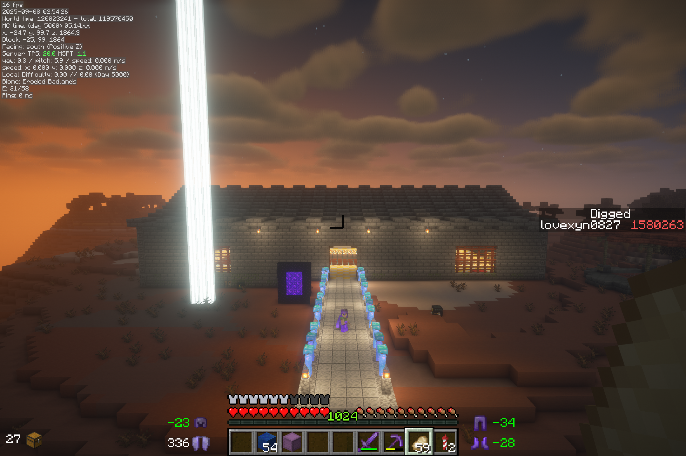

# 1.16单机生存（七）：5000天生存报告

## 概述

游戏版本：Java版 1.16.4

存档创建日期：2020年6月14日

存档内游戏天数：5000

存档大小：1267MB

------

## 时间线

- 2024.01.20（Day 3000）：书接上回
- 2024.03.01（Day 3033）：“引流之主”模型完成
- 2024.03.09（Day 3118）：字面意义上的“emo炸了”完成
- 2024.03.11（Day 3120）：用于“空城”路标的像素画完成
- 2024.03.15（Day 3131）：下界空置域开工
  - 2024.03.16（Day 3138）：修建长达410格的二连盾构机
  - 2024.04.08（Day 3340）：世吞行进空间清理完成
  - 2024.04.27（Day 3478）：防爆沟挖掘完成，准备铺设铁砧墙
  - 2024.05.11（Day 3545）：铁砧墙铺设完成
  - 2024.06.17（Day 3703）：世吞整体完成并开机测试成功
  - 2024.06.25（Day 3822）：世吞到达基岩层，空置域主体完成
  - 2024.06.26（Day 3825）：使用8台三向后续清理基岩缝中残余的可刷怪方块
- 2024.07.08（Day 3911）：简易“天基屠龙炮”完成
- 2024.07.12（Day 3916）：300m全自动采石机开工
  - 2024.07.24（Day 3986）：初始建造空间清理完成
  - 2024.08.27（Day 4138）：主体建造完成
  - 2024.09.21（Day 4255）：开机测试
  - 2024.09.24（Day 4300）：分类收集完成
- 2024.09.07（Day 4184）：JC1Z（鄄城一中东校区）复刻开工
- 2024.09.07（Day 4185）：存档运行的第一亿游戏刻
- 2024.10.18（Day 4371）：Y0猪人塔开工
  - 2024.12.31（Day 4703）：破基岩部分完成
  - 2025.02.16（Day 4765）：抑制器与BUD链修建完成
  - 2025.07.17（Day 4887）：切门换底生成平台完成
  - 2025.07.21（Day 4906）：下界生成部分完成
  - 2025.07.29（Day 4955）：主世界收集部分完成
- 2024.12.27（Day 4669）：新下界堡垒刷怪塔开工
- 2025.03.16（Day 4798）：黄黑色施工警戒线像素画完成
- 2025.08.06（Day 5000）：“Got to day 5000”

## 几张截图

截图按其中主体结构开始建造的时间排序：

> “引流之主”模型

2019年冬，那个有如“送东阳马生序”中描绘的那么苦寒的冬天，影流之主一度火遍全网，其中，有一系列以初三理化试题插图为核心元素的二创作品，恰好“撞上”了当时的课程内容；在这些内容间，又以或许是最初看到的“引流之主”最具代表性，且让我印象最为深刻。

印象中，也是计划了若干年，直到2024年2月14“情人节”那天，才抽出时间修建。

后来，还希望在周围做一些其他的装饰，比如像1.15生存中那样放一个水下玻璃罩的结构，然后在地下埋藏一段影流之主的红石音乐。但因为一直没有时间做具体设计，至今只能维持这种未完成的状态。

-----------

> 字面意义上的“emo”炸了

当时因为某些不便言说的原因，在Minecraft以外也是“emo炸了”的状态，索性就做了一个这样的装置。

不太清楚的点阵像素字符“emo”下面，是几十个同时触发的发射器，投掷出一系列TNT，炸出“emo”的字样：

----------

> 空城标牌与警戒线像素画

前者计划后期作为“空城”项目的主题标牌。因为其命名取自线下生活中的一系列“梗”，要素过多，此处此处擦去了其中的敏感信息。其实2024.3.9就已经完成主体，但后来等到了3.11这个纪念日才放下最后几个缺失的方块。建造过程估计在十几个小时左右？

后者是Y0猪人塔切门时因为经常“违规操作”而崩服所致的产物。背景部分只用了四个小时（结构简单），后来又用TNT相对快速地依次摆出了“规范施工”四个字。然后贴出来是下面的效果，放在施工现场，即使不能起到劝导“规范施工”的效果，也能据此标记一下当前的施工进度，提醒着规范地多做备份：

----------

> 下界空置域（靠近下界交通主线的1/2部分，另一部分暂时还没有农场）

一个至少自从2020年10月就把选址等计划了大半，甚至在此前一度差点动工，但最终还是拖到2024年才开始的工程。

为了最大化利用世吞的价值，并尽可能多地覆盖各种生物群系与结构、挖掘远古残骸，空置域覆盖了超过25×100区块。过程相对繁琐，所以放在了另一篇专门的文章当中，其中还给出了一些参考性的经验与技巧。

3000～4000游戏日的大部分都是围绕这个空置域进行的，挖掘耗时240小时+（不过一大箱远古残骸看着属实舒服）下面是全景图

-----------

> 天基屠龙炮（废墟）

因为接下来要修采石机，而印象中采石机又需要大量的末地石，索性准备新开一个末地门，修末地石农场。又因末地主岛杂物较多，不便手动打龙，所以就又修了这样一个屠龙炮（什么链式依赖[笑哭]）。可笑的是，到最后发现现代的采石机不需要末地石[shrug]。

基本上只是将260TNT复制阵列接到了一个简单的箭矢矫正上，设计简单，只做了3小时左右。但是，应是因为没有处理末影人搬运方块，屠龙炮在第一次使用后没有几天没有等太久就自动炸膛。

---------

> 采石机

因为后续工程需要大量陶瓦，所以选择在距离原点13000m左右的恶地群系修建。

参照“火弦月”的4分18秒采石机的设计，拓展到存档中的规模。修建耗时50小时左右，然后加上前期准备和遮光顶等附件，预估要接近100小时。整体超过十万方块，是目前包含方块最多的项目

----------

> 鄄城一中东校区（高中校园）复刻现场

当时只做了四个小时，后来因部分细节复刻不够到位，建造蓝图返工调整，至今还未恢复建造。完整建造的话，预计也是一个150+小时的大项目。

而且，虽说是4184天就已经开工，但说到底，当时只是抢在一亿游戏刻到来之前，象征性地放下几个方块，好让这一工程跻身“元老”的行列。

--------

> Y0猪人塔

> 以及主世界收集部分

Y0猪人塔的计划可追溯到2020年9月，也就是刚上高中那会。因为那时设想的“黄金岛”和与猪灵的“100万的大交易”需要大量黄金，那段时间曾为此在课余设计了一种Y0猪人塔，还推导了与刷怪游走相关的一条公式，估算了它的理论效率。作出效率只有15万的样机后不久，网上也陆续有UP主发布了原理相似的猪人塔，我也曾参考它们，重构自己的设计。同时，随着三向破基岩技术的推广，预估破基岩耗时被从1000小时压缩到几十小时，Y0猪人塔又渐渐成为了一个可行的工程。

尽管如此，因为其本身的复杂性，加上，修建过程仍极为繁琐，粗略估计耗时要在150小时+的量级。

首先是破基岩。破开107×107的区域时，每层基岩都需要两小时的时间拆装破基岩机，并随即挂机接近5小时，而10层基岩，就是70小时。枯燥的工作下，DDL从最初的11月10号，被一步步推到了12月31号。

接下来切门。虽然乍看上去或许简单轻松，但说句实在话，不真正地走上BUD链，真的很难知道切门换底究竟有多么地枯燥、繁琐，而且令人和服务端双双崩溃。64x64的生成平台，切门如果可以一遍过的话，只需要十几个小时。但实际情况是，切门需要严格规范的操作，稍有不注意敲掉一块铁轨，或是挖破上一列已经切好的门，就只能无奈回档。更糟糕的是，因为先前打算切出纵向传送门，提高一点效率，但直到切门进行了一个多月，才发现切纵向门的方案操作太过繁琐，预计耗时甚至接近了其它所有部分的总和，权衡后只能舍去。但此时，先前为切纵向门预留的缝隙又明显降低了生成效率，最后，也只有选择放弃这一个月的进度，从头再来。好在，在崩了不知多少次服，拖迟过多少次DDL，最后又重修了一次BUD链以后，持续了超过一个学期的切门工作最终还是得以完成。

还没结束，在2025年，1.16在生电领域几乎已经成为了远古版本，各种现代化的高级的储存技术都难以适用。加之这里的设计中，下界部分面积为64×64，而不是标准的33×33，现有的处死装置也无法有效处理。此外，巨量的TNT消耗也使得TNT掠夺的无损化成为必须。所以，几乎整个主世界部分都只能从头开始自己设计。经过了许久的尝试，才给出了一个可用的方案。

尽管如此艰难，过程中还是有难得的意外收获。中间因为破基岩机选择的变动，2024年10月19晚上合成的两万活塞暂时失去用途，倒也为后续几年提供了几乎用不尽的活塞储备。

然后，将近340万的效率，和一组TNT就能挂机一晚上的低成本（尽管需要MSPT保持200+）却也“赏心悦目”。

经统计，目前全存档的物资当中，800万的金粒储量竟占据了总量的一半之多。不过至于进一步的合成就是后话了（一想到要用二十多小时合成上百万金锭就……唉）

----

> 新下界堡垒刷怪塔（未完成）

来自“[世外樱花林](https://space.bilibili.com/383985008/?spm_id_from=333.788.upinfo.detail.click)”的设计，现在只做了很小一部分（但也用了好几小时），用来生产烈焰棒，继而为猪人塔供给岩浆块（虽然后面又发现因为更新抑制器的缘故其实不需要自带太多岩浆块）。

## 统计信息

游戏时间：1660小时

死亡次数：91

游戏退出次数：706

鞘翅滑行路程：15633.78km

生物击杀次数：10667690

### 使用最多的工具

- 下界合金镐（1580263）
- 下界合金剑（351484）
- 下界合金锹（173954）
- 铁桶（33363）
- 钻石锹（28006）

### 放置最多的方块

- 铁砧（481223）
- 活塞（145764）
- 圆石（105691）
- 红沙（68546）
- 粘液块（60509）

### 挖掘最多的方块

- 石头（748499）
- 地狱岩（332228）
- 雪片（56456）
- 闪长岩（44397）
- 花岗岩（43160）

### 合成最多的物品

- 骨粉（730678）
- 金锭（454112）
- 绯红木板（237581）
- 铁锭（182938）
- 白桦木版（181657）

### 击杀最多的生物

- 僵尸猪灵（5814008）
- 掠夺者（2022893）
- 卫道士（1645903）
- 幻魔者（433905）
- 女巫（429184）

然后，其实可以注意到，这里好多项目的排名一直都异常稳定，甚至，有些长期霸榜的项目中，也有个别2000天间竟没有一点增加。

## 总结

按照以往的惯例，继续与矿坑合影留念：

从3000天到5000天，2000游戏日的世界里，我们实际上只完成了下界空置域，采矿机和Y0猪人塔三个拿得上台面的项目，而这些又无不是自从2020年就开始规划的。不知是屠龙炮这样的小工程已经开始不起眼，还是现在就是大工程占据了主流，总觉，在漫长而繁杂的任务下，与其它许多活动相比，游戏反而成为了一种“繁重”的工作……

不管怎样，至此，我们完成了1000天开荒报告中所列出的最后一项“大工程”，也就是下界空置域，也算是给了当年的期望一个交代。但这并不是结束，JC1Z复刻，“空城”和各种半途停工的农场的后续建设，各种细枝末节的物资量产，137万守卫者农场等等，许多自几年前就提上日程的任务，至今还只是画了个大饼的状态。今生来路漫漫，还望能在Minecraft当中，不紧不慢地，继续行稳致远。
