# 1.16单机生存（六）：掏空2500区块的下界空置域

好不容易，今年又肝得动MC了（尽管还是做不到2020年那种每天连干10小时的程度），所以，就打算落实那个计划了三年半的巨型下界空置域。

选址依旧是三年前的选址。当时不知道把空置域修得狭长的麻烦嘛，就想着只做一台世吞，一次性地炸上个千吧来格，毕竟世吞做起来那么费时费力，总是希望一次性炸出更大的空置域：21 × 21区块的空置域和121 × 21的空置域用到的世吞规格是一样的，一次多炸一点肯定更有性价比。

经过一系列的微调，这里最终圈定了一个略大于25×100区块的区域，恰好包含了所有的下界生物群系和两座下界堡垒，准备施工。

##  时间线

- 2024.03.15（Day 3131）：开始第一遍盾构，为二连盾构机的修建提供空间
- 2024.03.16（Day 3138）：修建长达410格的二连盾构机（不过只用了五个小时，没有想象中的恐怖）
- 2024.03.16（Day 3153）：使用盾构机清理世吞行进空间
- 2024.04.03（Day 3270）：因为玄武岩三角洲区域二连盾构机多次炸膛，改用三连盾构机清理那一区域
- 2024.04.08（Day 3340）：世吞行进空间清理完成，开始挖掘侧沟
- 2024.04.13（Day 3370）：填埋防爆沟区域内的岩浆
- 2024.04.27（Day 3478）：防爆沟挖掘完成，准备铺设铁砧墙
- 2024.05.11（Day 3545）：铁砧墙铺设完成
- 2024.05.15（Day 3579）：开始修建世吞
- 2024.05.31（Day 3658）：世吞出发侧完成
- 2024.06.17（Day 3703）：世吞整体完成并开机测试成功
- 2024.06.25（Day 3822）：世吞到达基岩层，空置域基本完成
- 2024.06.26（Day 3825）：使用8台三向耗费25小时清理基岩缝中残余的可刷怪方块

## 耗时总结

修建空置域总用时大致在240小时，刨去挂机和准备耗材的时间后用时约180小时，是至今整个存档当中耗时最长的工程。

- 修建二连盾构机：5小时
- 使用二连盾构机清理1612格区域：约60小时
- 挖掘防爆沟：约45小时
- 修建铁砧墙（挂机）：约22小时
- 修建世界吞噬者：约56小时
- 世吞开机及维护：约40小时
- 基岩缝清理（挂机）约：25小时

## 过程/截图/踩坑记录

### 上层空间盾构

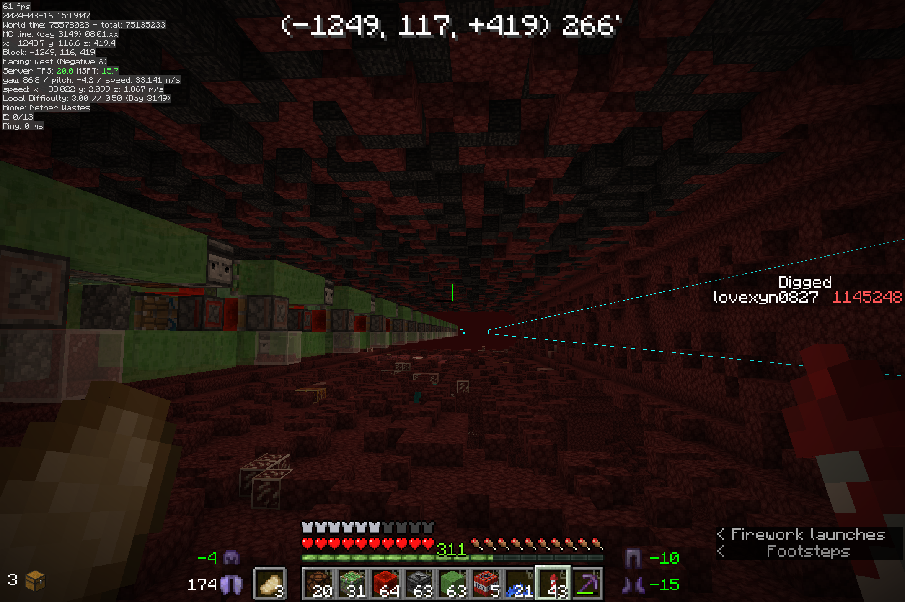

> 二连盾构机

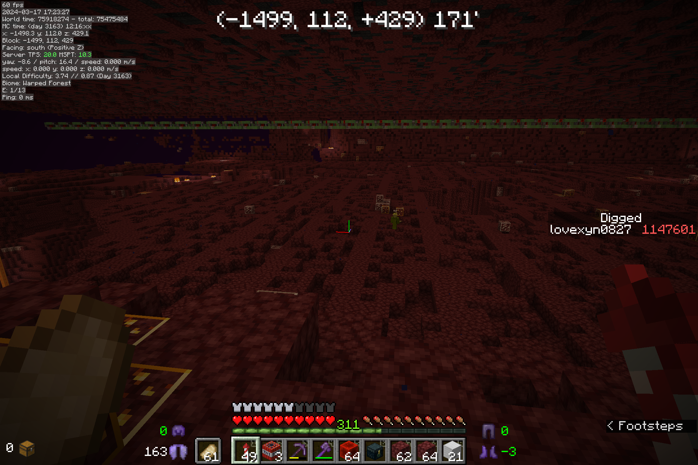

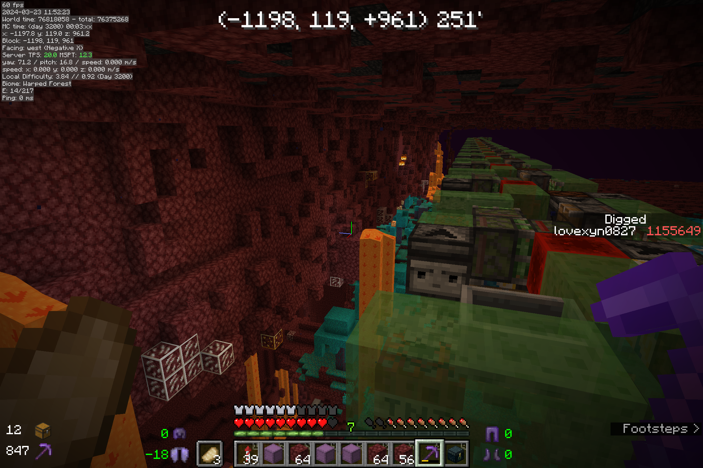

> 二连盾构机开机记录

使用二连盾构机时一定要保证盾构机所在的区域和所能炸到的区域全部被强加载，10视距下可以每格100格放置一个Bot用于加载区块（这个极易忘记）

推进盾构机时会暴露出很多的岩浆与下界残骸，清理不及时会导致盾构机炸膛。所以，建议每行进4到5格进行一遍彻底的清理，并在每行进100格（约2小时）后进行一次备份。需要说明，因为岩浆的保护而未被炸开的地狱岩依然有可能导致炸膛，所以，清理后要保证炸开的界面上没有明显的突起。

考虑到地狱岩是不可再生物品且在修建悬空机器时很适合作为脚手架，建议准备若干个潜影盒进行收集。

因为玄武岩三角洲地形方块的质地较硬 ，必须使用三连盾构机才能避免炸膛，同时留下足够大的空间。但是，全程使用三连盾构机并不合适，因为三连盾构机的行进周期要长于二连盾构机，而且清理空间范围更高，致使过程中处理岩浆更加复杂。

如果空置域像这里这样特别狭长，可以考虑在盾构机附近铺设一条冰道，方便从补给点（伪和平）到盾构机之间的移动。

另外，考虑到整个过程及其枯燥且耗时，可以在后台听书或者听课来使时间更加充实有趣。（下文同理）

顺带说一下，这一步当中图腾和烟花火箭的消耗速度是相当快的哦（每周一盒）

平均每天上线开两小时盾构，坚持大半个月终于了完成的长达1600格的盾构，进入到整个工程的下一阶段。

### 防爆沟与铁砧墙

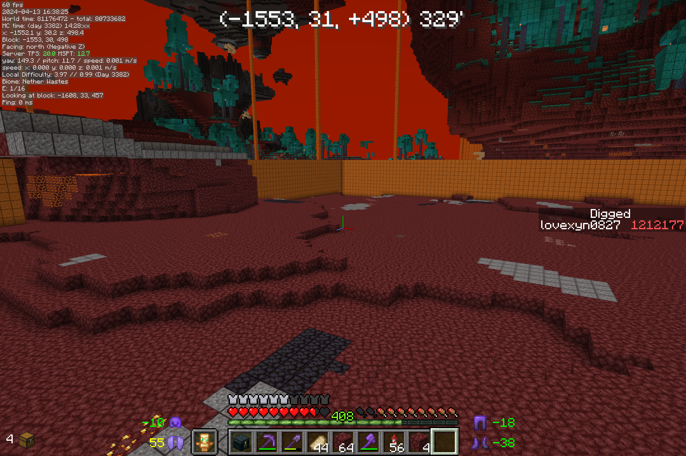

为了防止挖掘防爆沟时玩家落入岩浆，这里我们先用颜色与岩浆接近的红沙铺好了空置域边界中位于熔岩海的部分。这一部分大约占到了空置域边界总长的一半，也就是2000格。

铺设方块时，方块可能会落在灵魂沙上方掉落为物品并被烧毁，这在处于岩浆上方的我们来说好似一个无底洞。所以，在整个过程中，如果遇到20个方块仍无法填补的空缺则可以暂时跳过，待到最后使用抗火药水潜入岩浆海的底部一并处理。

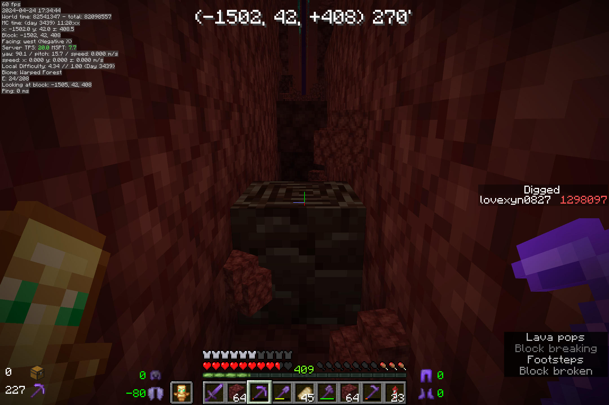

挖掘防爆沟的过程是特别枯燥的，但好在，还会有那么一点点的突如其来的惊喜。

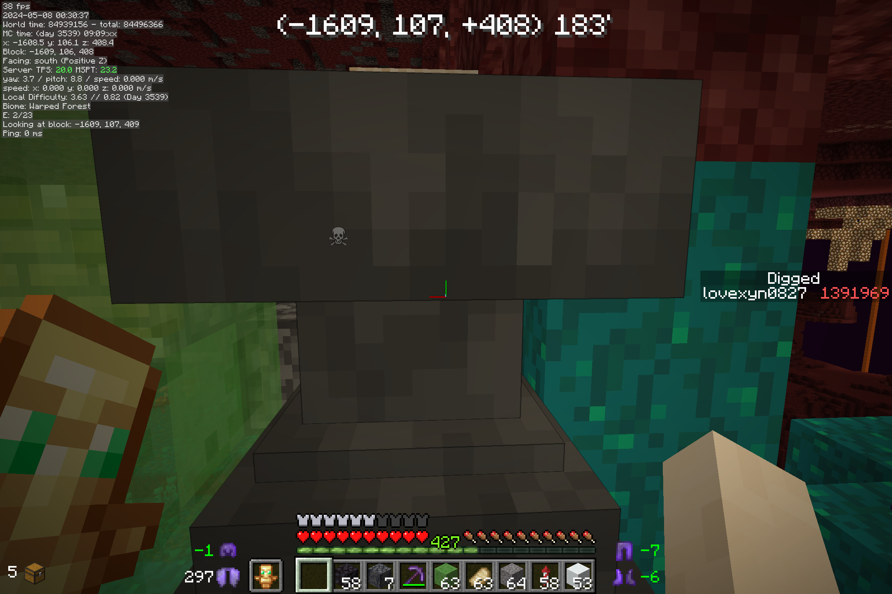

修筑铁砧墙的过程中，我们会始终面对这样单调的画面，只有背包中的铁砧用尽的时候，我们才得以移开视线，从潜影盒当中取出新的铁砧……这样的循环，我们会进行二百余次，直至将四十万个铁砧全部放置完毕，即使使用tweakeroo中持续放置的功能也不会使我们轻松太多……

想来，没有多少人可以忍受这样的过程，但是我们也有应对的方案。借助“物品分身”，我们可以将我们手中的物品“链接”到农场的收集当中。这里我们直接将我们背包内的铁砧与刷沙机收集上的漏斗矿车相连接，我们便无需亲自从潜影盒当中取出物品，继而，可以在无人干涉的情况下完成一整侧铁砧墙的修建。整个工程，便成为了纯粹的挂机工程。

嗯，上面的方法是我在铺好600格铁砧墙后才想到的，甚至在此前我曾准备好了200潜影盒的铁砧准备大干一场。

同时，铺铁砧机还有一个注意事项就是，客户端的tick需要和服务端的tick保持相对一致，换句话说，我们需要保证客户端FPS为服务端TPS的整倍数，20帧、40帧、60帧都是可行的，如果对不齐，玩家便无法一口气放下四个铁砧，继而拖慢铺设的速度。

### 世吞建造

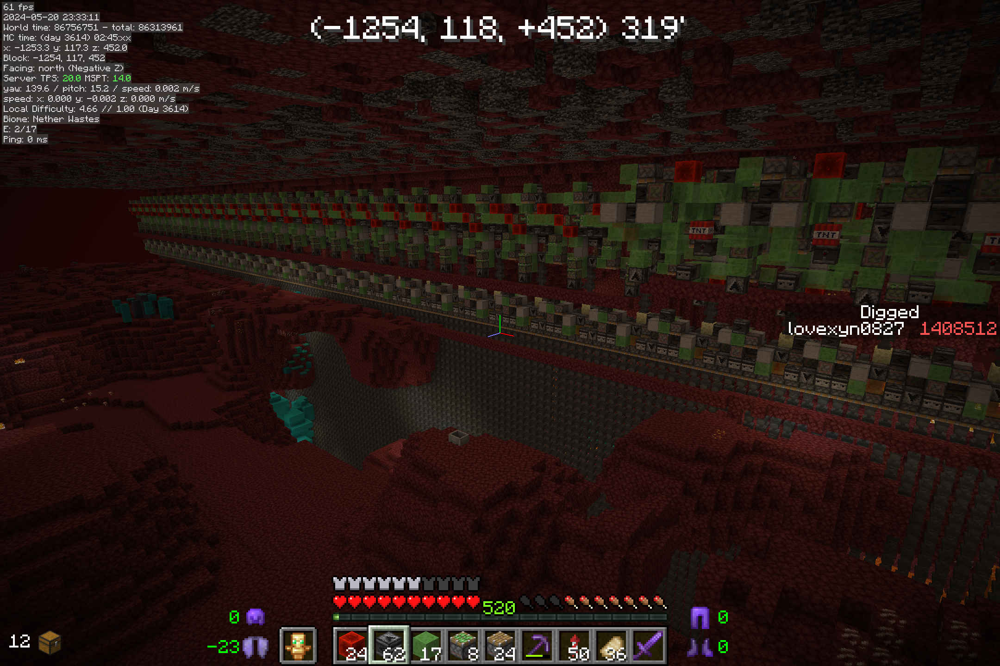

修建世吞绝对是一个让人干完一次以后一整年不想干第二次的任务。

为了熟悉流程，以便“避坑”，这里我们首先修建了整个世吞中60m长的一小段，然后再考虑修建世吞的其他部分。

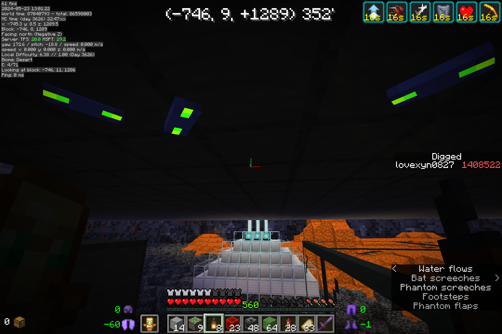

（意义不明的截图）

### 世吞的运行与维护

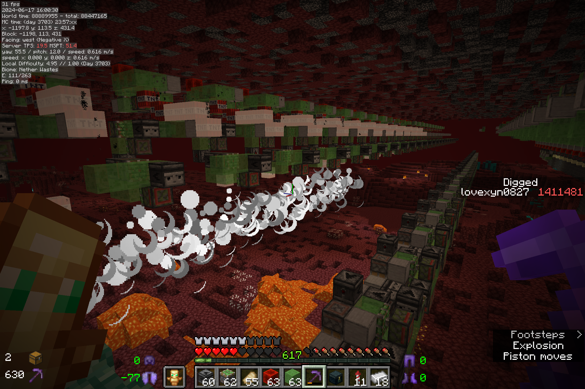

但是世吞刚刚开机的两个小时是真的真的非常爽！（嘻嘻）

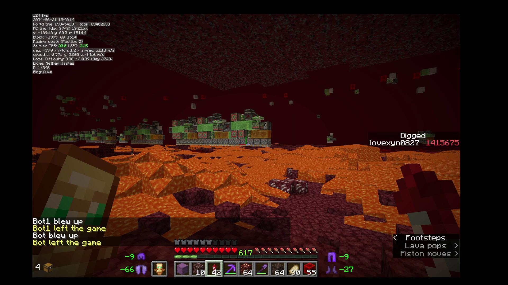

悠悠哉哉地挂机一会，上线一看，发现世吞炸掉了（不嘻嘻）

经过几次炸膛后，终于总结出了一个解释。

因为空置域面积太大，使用假人一次性覆盖操作过于繁杂，这里我们选择了使假人骑乘在世吞的矿车上，但是，如果服务端卡顿太大，玩家对区块的加载会被暂时地延迟甚至抑制。这样，在世吞带来的巨大负荷，若遇到了CPU温度过高或断开笔记本外接电源等导致CPU降频等情形，服务端将会持续地发生掉刻，假人可能将无法及时地加载远处的区块，最终导致世吞无法正常工作，甚至爆炸。

当然，世吞开机后也完全没有预想的那样轻松。一方面，空置域覆盖区域中有灵魂土、镶金黑石等不可再生资源需要回收（尽管5月中旬做世吞之前已经采集了一部分了）；另一方面，下界残骸，特别是20层以下的下界残骸常常会阻挡排水机的行进，致使世吞停止工作。

挂机是完全不能指望的，而且整个维护过程几乎就是三点一线的轮回，更要命的是，最后十几层还会有3000多块远古残骸需要我们及时发现和处理。三个一摞的、蛇形延伸的、嵌在黑石里面的、一个区块三个矿脉的，几乎什么样的都会遇到。特别是垂直地堆在一起还埋在岩浆里面的那种，卡排水机几乎一卡一个准。卡排水机却也不一定一次性完全卡住，有时排水机可能会把残骸推到空置域两边的铁砧墙上，等到下一轮再去卡。讲真的，将近80%的远古残骸都在20层以下，如果遇到世吞行进一遍被残骸卡住十几组排水机，在送排水机走一千格的距离复位时是真会失去挖掘残骸的那种满足感的。

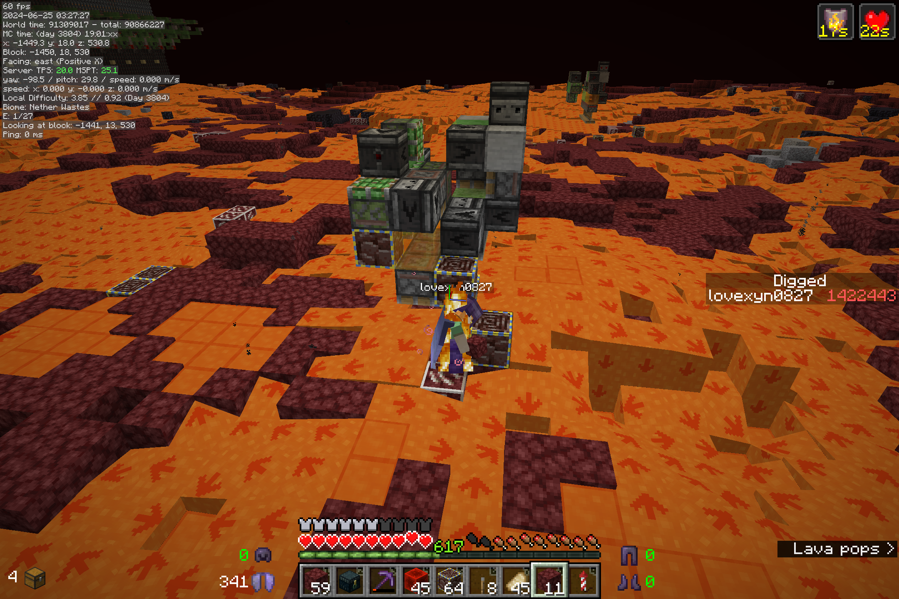

不过，因为开世吞的那几天恰好是期末周刚刚结束，“小学期”尚未开始的时候。从5月底开始，晚上熬夜赶作业、复习课本的日子越来越多，在那些“压迫”的反衬下，在空无一人的宿舍一天一边听着说书一边连开10个小时世吞竟也成了一种别样的放松。

这样，只用了几天，6月25号晚上空置域便告完工。

最后还有一点点小插曲，因为当时忘记了将铁砧墙下方的方块替换成防爆方块，在炸开最后两三层的同时，如果铁砧墙下面的方块被炸掉，铁砧墙便会受重力下落，失去防爆能力。把最后几层的边缘炸得满是被炸飞的铁砧填满的坑洞至少还不影响空置域的正常使用，但是，世吞上有一个朝向铁砧墙的侦测器，在铁砧墙移动时会被错误激活，导致世吞损坏，这却也成了一个做了N遍检查才解决的问题。

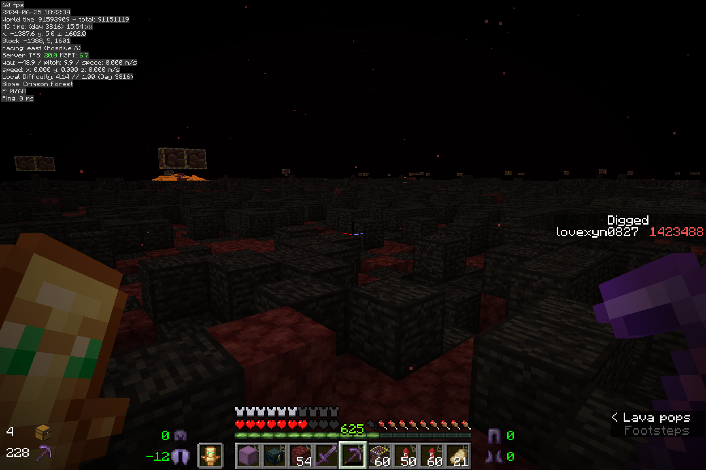

最后两三层世吞开起来没有那么累，但很有氛围感，给人一种“曲终人散”的美。

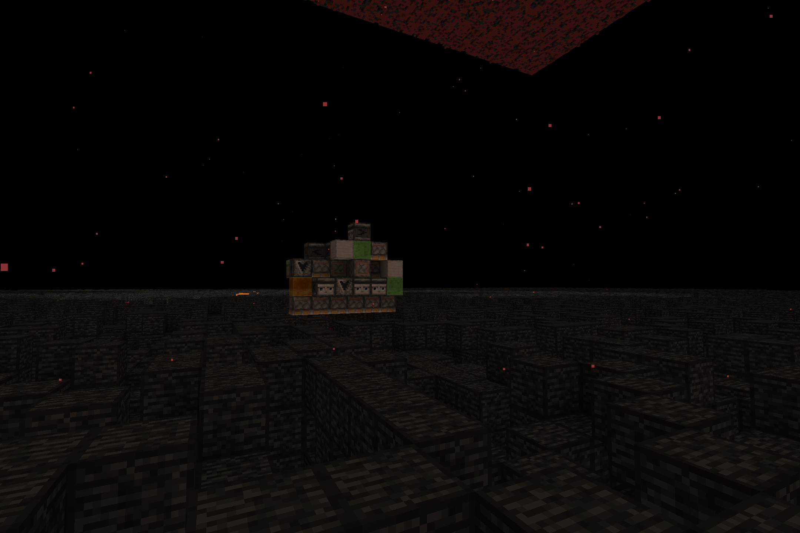

最后一台排水机在等待着复位，非常有意境的画面。

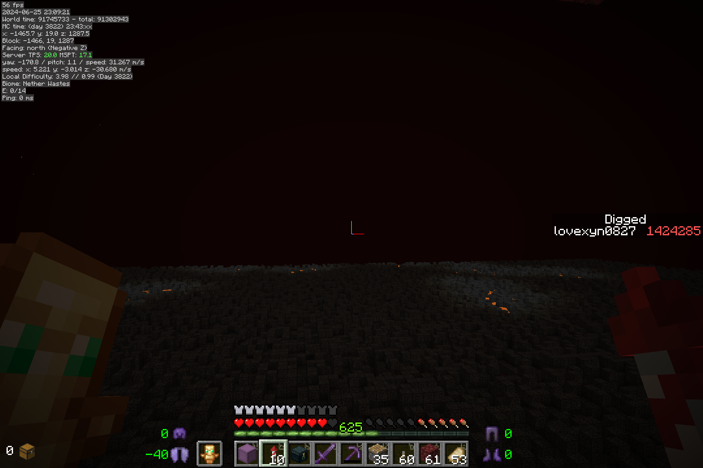

不论如何，空置域完成了。望向为之忙碌了几乎一整个学期的这片空阔而又寂静的空间，生发出的不是其它项目完成后的那种满足，而是一种莫名的陌生与怅然。

世吞开完以后，最高的基岩层及以上的岩浆和几乎所有的暴露方块都被清空，空置域可以算作已经完成。但是，保险起见，这里又使用了8台最简三向轰炸机清理了一遍基岩缝（连续挂机25小时）。

## 总结

整个空置域花费了将近240小时，开采得到将近4000块远古残骸，平均下来每小时可以采集到16.7块远古残骸，效率甚至远不如传统的床炸法开采。不过，一整箱有余的远古残骸摆在那里确实看起来特别舒服：

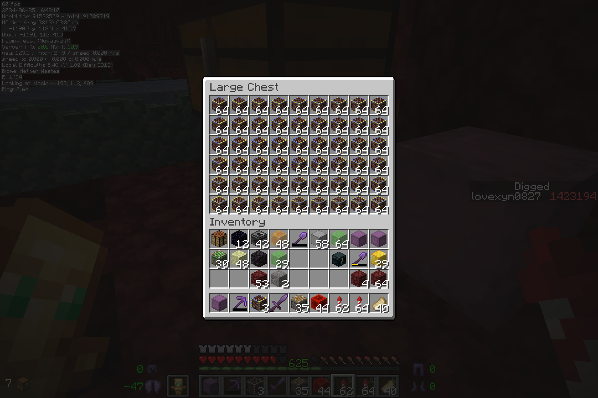

当然，烟花的使用速度依然一如既往地迅速，尽管有先前修筑的冰道作为辅助运输途径，世吞运行的整个过程中，消耗的烟花总量还是有一整盒（相当于平时两三个月的用量），而且，因为消耗太快，这里不得不一次取出两组甚至三组烟花随身携带。

这样一个25×100区块的空置域可以用来做什么呢？2020年10月选址时其实考虑到了两个目的，一是包含两个下界堡垒分别修建凋零骷髅与烈焰人农场，二是要有一片面积足够大且不与下界堡垒“相冲突”的下界荒地来为当时设想的Y0猪人塔提供空间。此外，在后来修建时，又对具体坐标相对做了一些调整，并使得空置域恰好可以同时包含全部四种群系，方便修建疣猪塔、恶魂塔等在内的多种农场。

接下来，应会选择先修建Y0猪人塔，圆一下，多年前的“黄金岛”和与猪灵“一百万的大买卖”这两个设想。
