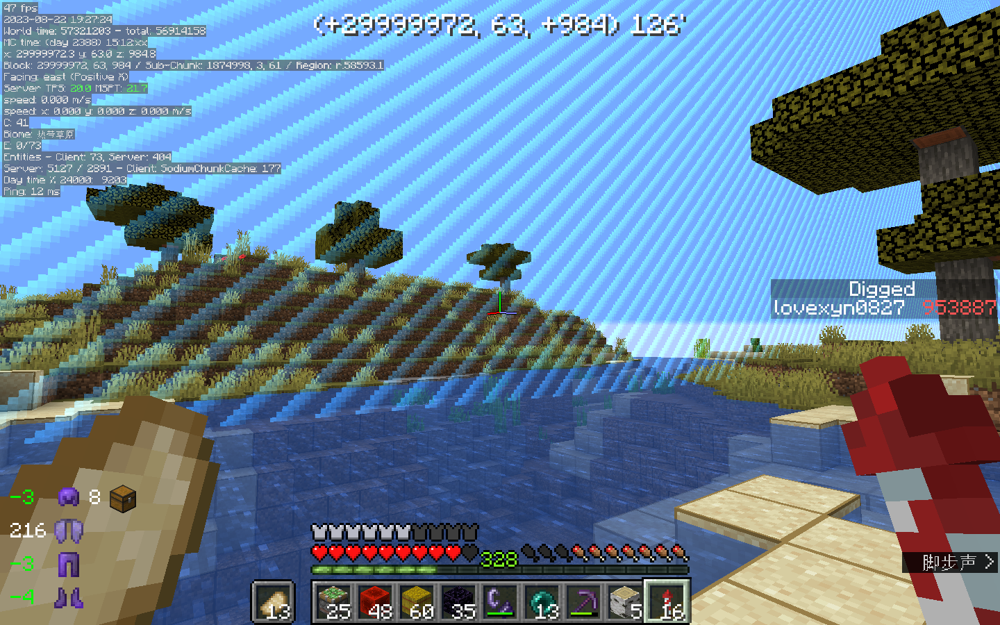
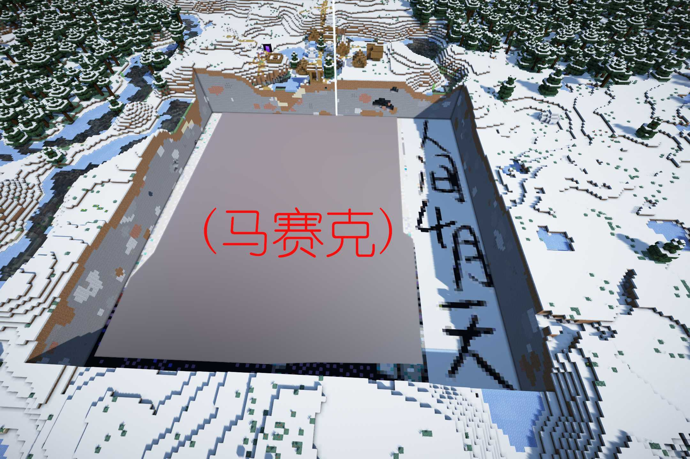

# 1.16红石生存【五】：3000天生存报告

> 原帖日期：2024-01-22

## 概述

游戏版本：Java版 1.16.4

存档创建日期：2020年6月14日

存档内游戏天数：3000

存档大小：1168MB

---

## 时间线

- 2022.8.31（Day 2022）：“书接上回”
- 2023.4.4（Day 2034）：来自YN像素画的“精神污染”
- 2023.5.1（Day 2047）：开始繁殖羊驼
- 2023.6.17（Day 2067）：羊毛机部分完成
- **2023.6.23（Day 2082）：原点碑林（坟场）扩建**
- 2023.6.23（Day 2102）：羊毛机投入使用
- 2023.7.2（Day 2140）：头颅塔完成
- 2023.7.19（Day 2197）：边境炮空置域开工
- 2023.7.21（Day 2222）：”井“（2222，横竖都是二）
- 2023.7.30（Day 2247）：获得熊猫
- 2023.8.18（Day 2313）：边境炮空置域世吞开机
- 2023.8.18（Day 2324）：边境炮空置域完工
- 2023.8.22（Day 2382）：边境炮完工
- **2023.8.22（Day 2388）：前往世界边境**
- 2023.8.24（Day 2431）：守卫者农场完工
- 2023.8.27（Day 2478）：下界交通西线完工（全长1600m）
- **2023.8.27（Day 2488）：挖掘量突破100万**
- 2023.9.15（Day 2534）：“鬼城”地面清理开始
- 2023.9.21（Day 2567）：原点碑林装饰
- 2023.9.29（Day 2617）：“阴间信标小屋”完成
- 2023.10.3（Day 2659）：下界菌类农场完成
- 2023.10.5（Day 2672）：改建末地蜂蜜农场
- 2023.11.19（Day 2740）：改进新房内饰
- **2023.12.17（Day 2777）：Re：从0开始的无红石生存**
- 2023.12.25（Day 2818）：获得第一个附魔金苹果
- 2023.12.28（Day 2862）：新混泥土固化机完成
- 2023.12.31（Day 2881）：半全物品分类仓库完成
- **2024.1.3（Day 2960）：“人间四月天”像素画完成**
- 2024.1.20（Day 3000）

----

## 几张截图

​     稍微修缮以后的新房，但是几乎看不出明显的区别。

---

​     咕了三年的守卫者农场。照三年前的设想是需要修一个空置域的，但因为需要赶在8月27日前（4天内）完成下界交通，最终只修了这么三片。（然而还是用了13个小时）

---

​     断断续续设计了一年多的矢量羊驼边境炮。边境炮下面还有一个顺便修来用于节约性能开销，获取远古残骸的小空置域，比较奇葩的是，建造边境炮本身实际上只用了不到10小时，但是挖掘空置域却用了40多小时。

​     边境炮原理讲解：[https://www.mcbbs.net/thread-1473446-1-1.html](https://www.mcbbs.net/thread-1465833-1-1.html)

​     实装边境炮时写的主题贴：https://www.mcbbs.net/thread-1465833-1-1.html

​     顺便贴一张当时前往世界边境的截图。

---

​     半全物品分类仓库。这个项目也是从2020年秋天就开始计划的，不过实际的准备直到2023年夏才开始。修建分类仓库本身的工程量其实不算太大，准备和填充分类所用的物品才是真的麻烦。

​     因为物品储量太少，仓库完工后其实并不能立即投入使用，暂时只能当成一个大号的“垃圾桶”。

---

​     休闲区。因为修建和维护红石机器太过无聊同时又不愿开新存坑，就在存档中找了离出生点4000m左右的一个小岛来一场“从零开始”的生存。图中是仿照2019年冬天的设计建造的一间小屋，满满的怀念啊。

---

​     “人间四月天”像素画。（然而像素太低qwq）

​     按2022年最初的设想是打算把像素画先修在地下，之后再找合适的时机炸开像素画上方的方块。到开工时，已经几乎找不到这么做的意义了，但还是照最初的想法走了那么一遍流程。

​     来历嘛，还是致敬高二高三的那些日子里的“某些人与事，还有一段金色时光”。

​     （再也不想在雪原修像素画了）

---

​     阴间的“信标小屋”。

​     最初的来历是2016年时在Java 版1.9.4某个存档的一座雪山上修建的一间信标火柴盒（当时还不知道信标的用途及获取方法）。后来，在2021年夏天，又在创造存档当中做了这么一个信标小屋，最终闲来无事有把它实装到了生存存档当中。（其实铁锅炖蜜蜂、炖蝙蝠这样麻烦的整活内饰还没有完成）

---

​     修到一半就不想修了的蜂蜜农场。又是一个三年前就列上日程的物件，左边还有一个记不清什么时候建造的简单蜜脾农场。

---

​     效率可观的下界菌类农场，在一定程度上可以取代一般树厂，不过缺点是工程量要比常见的树厂大一些。

---

​     也是修到一半就不想再修的羊毛机。

---

​     “井”。修建后不久就改造成了一个略大号的“两响炮”。

---

​     原点碑林（坟场）。

---

​     MC版的“年度总结”。

---

​     新的混凝土农场。尽管其效率因为刷沙机不配套没能达到最大，也要比2022年当场搓出来的要高上十几倍。

---

​     最长的也是最后的一条下界交通主线。1500多格，算上开盾构修了20+小时。（做完后好多天不愿动MC）

---

​     为了修建“空城”清理的一片500×500的地面，现在完成了大概2/3（工程量愣大）。

​     莫名其妙地就很喜欢空城的那种气氛。

​     修完“空城”之后如果还剩下地方的话，也许会在那里试着复刻一下自己高中时的母校吧。

---

## 统计信息

游戏时间：994小时

死亡次数：89

游戏退出次数：388

鞘翅滑行路程：9076.60km

生物击杀次数：2783956

### 使用最多的工具

- 下界合金镐（1120504）
- 下界合金剑（266316）
- 下界合金锹（105575）
- 铁桶（32003）
- 钻石锹（28006）

### 放置最多的方块

- 圆石（75918）
- 铁砧（62643）
- 平滑石头（38317）
- 石砖（43006）
- 玻璃（41382）

### 挖掘最多的方块

- 石头（675351）
- 地狱岩（98103）
- 雪片（56456）
- 闪长岩（40432）
- 花岗岩（39363）

### 合成最多的物品

- 骨粉（553617）
- 金锭（284543）
- 铁锭（128087）
- 白桦木版（127319）
- 铁块（66865）

### 击杀最多的生物

- 僵尸猪灵（1056812）
- 掠夺者（723015）
- 卫道士（588630）
- 幻魔者（155232）
- 女巫（153381）

---

## 总结

​     截止到3000游戏日，自己在2021年的1000天开荒报告中提到的四个“大工程”已经完成了两项，余下的两项也或多或少地进行了尝试。此前设计的边境炮也在这一时期当中得以实装。

​     存档中很多常用物品也已经实现了自动量产，尽管一些农场效率仍略显不足，但总体上也可以在短期内满足修建建筑的需要。

​     最近一段时间，自己不再能像2020、2021年那样日常连干十几小时，更经常是打开存档过两三小时甚至只是转上几圈找不到事干就会退出。哦，果然，生电存档时间久了也是会变得枯燥的。

​     从2020年中考前夕到现在，这个存档见证了我的整个高中时代，见证了那些日月中不住地反反覆覆的诸多故事。高一的“不努力”，高三的“徒伤悲”，还有，高二那年归于平平淡淡却无比幸福的，寒冬·四月·盛夏的小幸运……不行，说多又要emo了……

​     最后再按照惯例来一张与矿坑的合影：

