# 1.16单机生存（一）：一千天开荒报告

> 原帖日期：2021-02-14
>
> 为保持内容与原帖一致，文中部分表述欠佳，莫见笑。

## 时间线

前300天可能看起来有些水篇幅，对吧。那就看后边。

注：1000天内出现多个的会注明初代，二代等。

- 2020.6.14（Day0）：创建存档。
- 2020.6.21（Day27）：温（钻石套）饱（烤土豆）基本得到保证
- 2020.6.26（Day32-32）：末地成功解放，顺便得到鞘翅潜影壳。
- 2020.6.26（Day47）：第一台机器——全自动刷石机完成。至此，工业化开始。
- 2020.6.27（约Day54）：初代猪人塔完成，经验大幅贬值。
- 2020.7.5（Day77）：下界合金基础套（全套盔甲+精准镐+亡灵剑）完成。
- 2020.7.5（Day85）：第一个满级信标完成。
- 2020.7.12（约Day100）：初代刷铁机完成。
- 2020.7.12（约Day120）：初代水流刷怪塔基本完成，数天后改善。
- 2020.7.17（Day132）：初代自动熔炉完成。
- 2020.7.17（Day140）：初代蜂蜜农场完成，18号Day150升级二代。
- 2020.7.18（Day157）：初代刷沙机完成。
- 2020.7.19（Day182-202）：矿坑挖掘部分进行中。
- 2020.7.20（约Day220）：初代史莱姆农场完工
- 2020.7.21（Day235)：矿坑最终完工。
- 2020.7.22（Day251）：初代树厂完工（其实之前还有个失败品，略过）。
- 2020.7.22（Day270）：聚宝盆空置域开工。
- 2020.7.26 14时（Day364）：聚宝盆空置域主体完成。
- 2020.7.27（Day381）：炸怪塔完成。
- 2020.8.1(Day433）：Y0史莱姆农场完工（基岩破了14小时）。
- 2020.8.2（Day440）：一次性凋零玫瑰农场完工。
- 2020.8.3（Day450）：极简疣猪农场完成。
- 2020.8.13（Day476）：凋零骷髅塔完成。
- 2020.8.13（Day495）：杀凋机完成并第一次开机。
- 2020.8.14（Day522）：新房完成，结束了住地下的生活。
- 2020.8.14（约Day530）：初代末地村民工程结构完成。
- 2020.8.14（Day534)：无敌水晶基本成功获取。
- 2020.8.15（Day555）：（基本是失败品）刷冰机完成。
- 2020.8.16（Day568）：初代甘蔗机完成。
- 2020.8.17（Day590）：西瓜机完成。
- 2020.8.18（Day622）：女巫塔完成。
- 2020.8.19（Day642）：二代自动熔炉完成。
- 2020.8.19（Day647）：再探末地城，解决潜影盒不足，鞘翅无后备等问题。
- 2020.8.20（Day679）：二代刷铁机基本完成。
- 2020.8.20（Day685）：初代珊瑚机完成，9.11（Day892）修改。
- 2020.8.20（Day690）：首次盾构机挖矿完成。
- 2020.8.21（Day705）：二代猪人塔完成。
- 2020.8.22（Day716）：二代刷石机完成。
- 2020.8.23（Day789）：下界交通南向干线一期和矿坑支线完成。
- 2020.8.23（Day787）：原点纪念碑完成（后开始的，所以放后面）。
- 2020.8.23（Day790）：稳定运行了200小时的一代刷铁机损坏。
- 2020.8.27（Day814）：矿坑装饰基本完成。
- 2020.8.27（Day818）：刷雪机完成。
- 2020.8.27（Day827）：（不便细说）。
- 2020.8.29（Day851）：二代甘蔗机完成。
- 2020.9.10（约Day861）：主世界僵尸村民伪和平完成。
- 2020.9.11（Day890）：下界凋零伪和平完成。
- 2020.9.11（Day903）：原计划下界空置域第一遍盾构，后因选址变更停止。
- 2020.11.8（Day925）：两台刷花机完成。
- 2021.2.1（Day952）：全树种树厂完成。
- 2021.2.2（Day967）：猪灵交易厂完成。
- 2021.2.5（Day977）：二代刷沙机完成。
- 2021.2.11（Day980）：新年庆典。
- 2021.2.14（Dat986）：CCS牌袭击农场开工。

## 主要项目截图

1. 出生点：含二代刷铁机，刷沙机收集。

2. 老家：含地窖，瓜地，初代刷石机，初代刷铁机，初代史莱姆农场，蜂蜜农场，初代熔炉组，初代树厂，假人伪和平等。除树厂来自ilmango外，剩下的基本上...都原创？

3. 初代刷怪塔（原创，但...）

4. 空置域

5. 新家：含新房，二代熔炉组，二代刷石机，全树种树厂等（只有第一个完全原创）

6. 女巫塔（清刷怪用的三向扫地，有些难看）

7. 伪和平（前者具体设计原创）

8. 矿坑（原创，核心工程，原因看矿坑地下（好吧，不便公开））

9. 刷花机（原创）为什么修两个？少了不全。

10. 下界基岩上层：含两代猪人塔，猪灵交易场，杀凋机，实验装置等

11. 凋零骷髅塔

12. 下界交通（已完成部分）

13. 第一次盾构机挖矿遗迹

14. 末地主岛：含刷沙机，一次性凋零玫瑰农场（已损坏），刷雪机（雪人死亡）

15. 末地农业工程：二代甘蔗机，瓜机

16. 末地村民工程：含主村民繁殖机，一代甘蔗机，交易所（未完成）

17. CCS牌袭击农场（未完成）

## 统计信息（部分）

电脑不够好Minecraft现在打不开，直接看json

游戏时间：329.12小时，合13.71天

死亡次数：66

跳跃次数：162571

音符盒调音次数：95477（tweakroo惹得祸？？？）

徒步及游泳移动距离：1390.3KM

鞘翅飞行距离：2954.5KM

受到伤害：30289.1

造成伤害：602578.9

杀死生物总数：242224

杀死玩家总数：52（基本全是假人，不然就是**）

工作台狂魔此数：121

使用最多的工具：下界合金镐（184182）

挖掘最多的方块：石头（72133）

捡起最多的物品：石头（25155）

放置最多的方块：平滑石头（32264）

损坏最多的工具：剪刀（8）

合成最多的物品：骨粉（134489）

杀死最多的生物：僵尸猪人（207010）

**最后，来张与矿坑的合影**

1000天，基础设施基本完善，除红石粉，绿宝石，远古残骸等原材料外，大部分物品**充足，可以宣告，开荒已经完成。
结束了？远没有。部分工程仍在进行，或有待改善；下界空置域，守卫者农场，YN像素画和其余几路下界交通等真正的大工程还没有开始建设，甚至连一个像样的刷冰机都没有。所以，仍需继续。

# 1.16单机生存（二）：YN空置域工程第一期——拒绝狗啃墙，从我做起

> 原帖日期：2021年8月3日
>
> 中间因MCBBS闭站一度轶失，直到发布四年后的今天才重新找到。不过，因为某些原因，其中许多截图暂不能确定，具体用的是哪一张，或有偏差，但大意应该接近。

还是1000天开荒报告的老格式。这几天找不到要做的工程，太大的时间和材料暂时不够，太小的根本不值得专门去提，加上马上就8.27了，这次就做一个YN像素画空置域准备一下。

## 一.时间线

2021.04.18（Day1093）确定范围，开始圈地

2021.05.04（Day1122）96（6x16）个信标部署完成

2021.07.24（Day1146）搞了一下村民交易场，终于有了10块钱的经验修补和稳定的耐久III以及钻石装备来源

2021.07.24（Day1186）防爆沟完成

2021.07.24（Day1193）炸了一点远古残骸，顺便让老装备退休

2021.07.26（Day1210）排水工程完成

2021.07.26（Day1214）防爆水墙完成

空置域部分前天晚上已经开炸了，现在还没炸完，中间炸了大概2/3，就先不细说了。

## 二.几张截图

信标部署完成

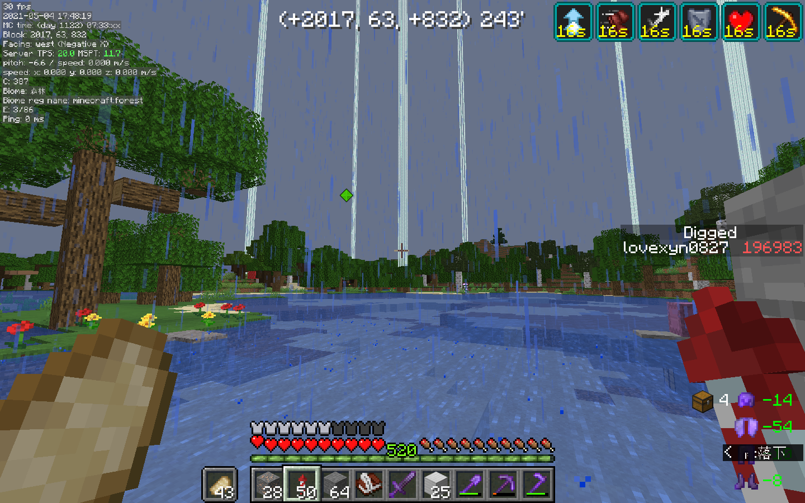

防爆沟完工

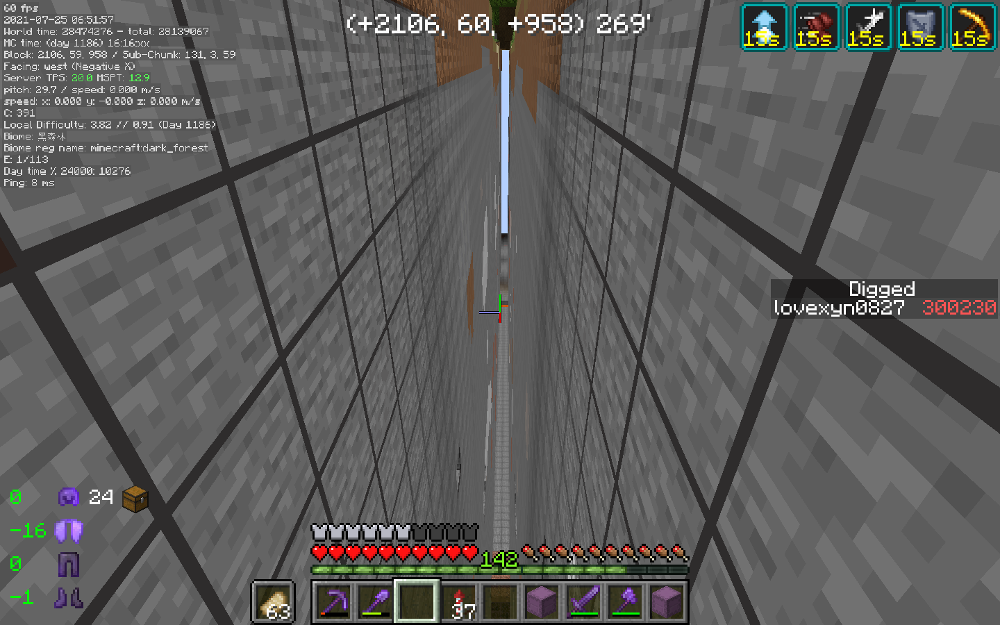

一个小插曲（试问该怎么出去，背包就这些东西）

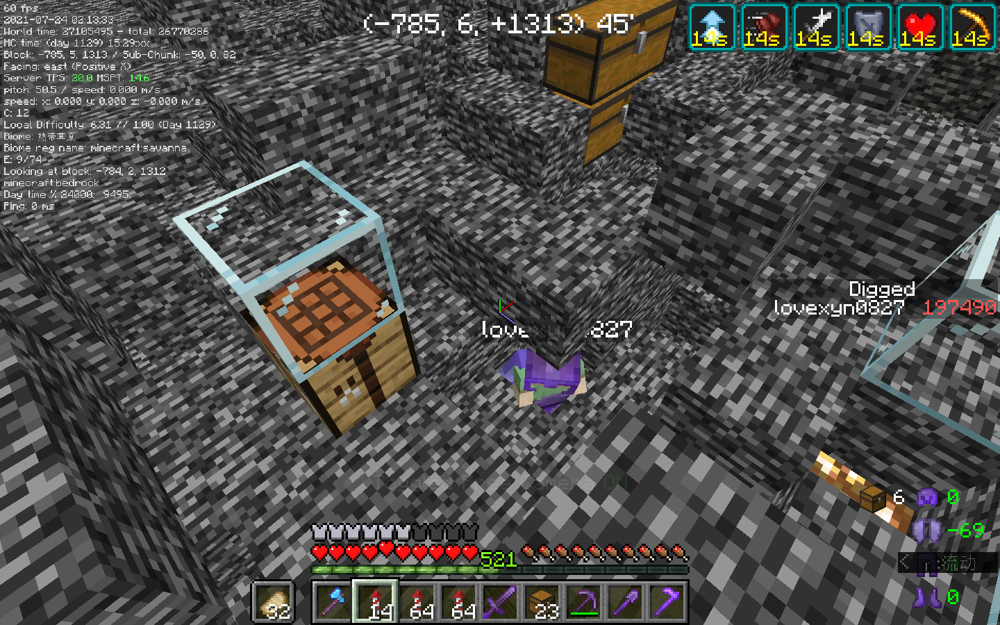

想起来这是什么梗了吗？

谁说我是因为没有装备回档的来着？

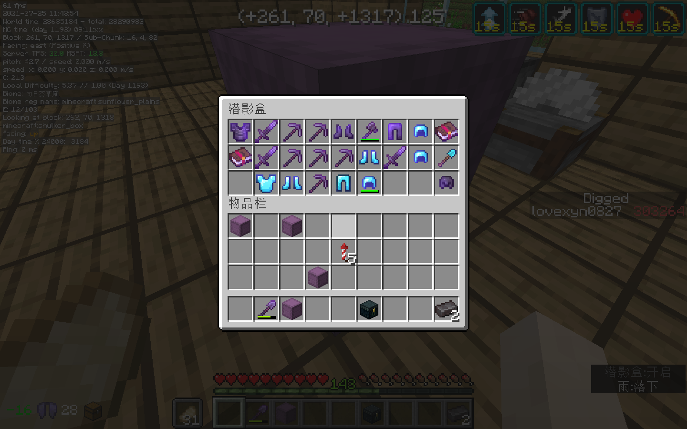

M C 盐 场（好像小了亿点）

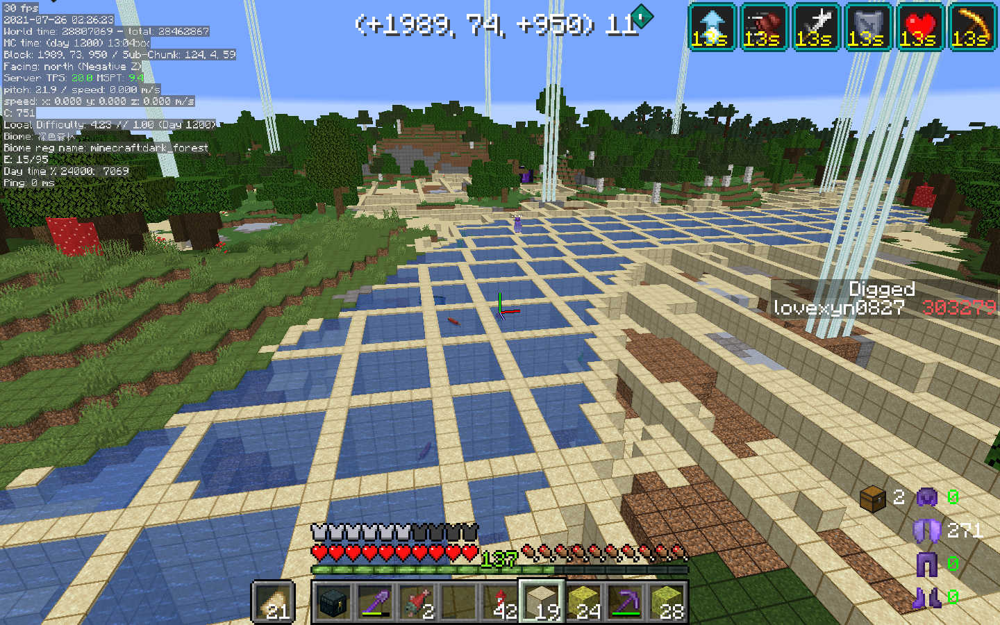

水墙

## 三.心得

手挖防爆沟根本不是人该干的事，256*256的像素画空置域就挖了接近20小时（前后挖掘量增加了10万），而且过程极度枯燥，干过第一遍就不想干第二遍（就像Y0史莱姆农场破1000基岩）。以后大概再也不会手挖防爆沟了吧，如果有合适的机器的话.

# 1.16单机生存（三）：2000天生存报告

> 原帖日期：2022-09-01

## 概述

存档创建日期：2020.06.14

存档大小：869MB

游戏内天数：2022

## 时间线

因为零碎的工程少很多且挂机和挖空置域占据了大部分时间，时间线要比前一千天简短很多。

这次的时间线中也注明了每个项目的耗时以供参考（如果真有人打算建那样的工程的话）

- 2021.02.14（Day1000）：Day1000
- 2021.02.16（Day1036）：CCS牌袭击塔主体完成，然后因故障搁置（4h+1000天前6h）
  - 2021.08.22（Day1476）：运输村民继续完成袭击塔（9h？）
- 2021.04.05（Day1069）：为新村民交易场铺设平台，然后再次搁置（2h）
  - 2021.08.23（Day1530）：新村民交易场主体完成（<4h）
  - 2021.08.26（Day1548）：凑全附魔书交易并准备其他职业村民（6h）
- 2021.04.18（Day1081）：基于村民的小麦农场完成（以后还要扩建）（4h）
- 2021.04.18（Day1093）：为像素画空置域选址并开始布设信标（单这一个占一半时间）
  - 2021.05.04（Day1122）：信标部署完成（9h）
  - 2021.07.24（Day1186）：防爆沟挖掘完成（21h）
  - 2021.07.26（Day1216）：地面流体清理及防爆水墙完成（10h）
  - 2021.08.05（Day1296）：三向轰炸机清理完成13层以上方块（23h）
  - 2021.08.12（Day1353）：边缘处方块清理完成（10h）
  - 2022.01.03（Day1636）：空置域挖掘完成（50-60h）
  - 2022.08.15（Day1838）：像素画完成（30h）
- 2021.08.06（Day1304）：溺尸刷怪场完成（讲真的，除了刷怪刷得快不比不修方便）（2h）
- 2021.08.21（Day1448）：东线（袭击塔）下界交通完成（7h）
- 2022.04.05（Day1649）：基于天然降雪的炸雪机完成（其实很大程度上是个沙雕红石）（18h）
- 2022.07.28（Day1728）：混凝土工厂完成（现搓现用，效率特低）（3h）
- 2022.08.17（Day1870）：北线（雪原）下界交通完成（6h）
- 2022.08.19（Day1901）：刷冰机完成（暂时只做了Fallen_Breath的刷冰机的一片）（小空置域3h+主体7h）
- 2022.08.21（Day1935）：稍微装修一下住处（似乎越装修越乱）（11h）
- 2022.08.30（Day2019）：墨鱼塔完成（黑色颜料实在缺）（4h）

## 几张截图

因为一些原因，部分图中的信标光柱未被渲染

主要是加了个围墙。（修大点倒不怎么像监狱了，尽管忘了留门）

还有一个天上那个刷怪塔，注意它在一般生存中不大适合通用目的的刷怪，倒是刷唱片挺方便。

像素画矿坑，但像素画不大方便放出来。

年初发过一个视频

[懒人版区块挖矿法_哔哩哔哩bilibili_实况](https://www.bilibili.com/video/BV1mq4y1c7GM/?spm_id_from=333.999.list.card_archive.click&vd_source=026ca52f62eb72221fbf7dda443eb9a1)

新村民交易场，加上繁殖机和地上营造气氛的总共300多个村民，就是一个Bot不挂到了地方也几乎要掉刻。

两个下界交通路线

随便做的一个混凝土固化，但是可能是刷沙机不配套，机器并不能正常地满速工作。

从Fallen_Breath的刷冰机中拆下来的一片，暂时能满足需求，以后修守卫者农场时应该会补全其他四片。

在雪原中用三向炸空置域时返回站所能经过的位置上方应该用一些方块挡住，以防被降雪影响。

修了一个空置域环境的溺尸刷怪场（差不多弃用了）和墨鱼塔，又给炸怪塔装上了物品分类。

这种墨鱼塔不用堆太大的刷怪面积，因为刷怪上限就五个，而且处死还比较随缘（同时也慢）。另外挂机点也需要特殊的安排，到刷怪区域的距离不止是要超过24m，还需要不大于32m，否则鱿鱼会停止游动。

加了个小的仙人掌农场，没什么用

CCS牌袭击农场，可以生产大量绿宝石（比石头还要便宜）、红石、萤石等物品，完成后瓜机和女巫塔直接退休。

去年设计的基于天然降雪的刷雪机，工程量还大，卡顿还高，还对天气有要求，纯属整烂活。

用村民收割的自动小麦农场，摞了一层就懒得再修了，不过以后大概会补上。原作者黑山大叔。

“破书架机”，从村民交易得到的书架中解压出书，也是没什么大用

矿坑那里也请上了几个门卫（朝向出了点问题？）

## 统计信息

游戏时间：669h

死亡次数：70

徒步及游泳距离：3027.2km

鞘翅飞行距离：6212km

造成/受到伤害：1854515/77253（一大半是挂机饿出来的伤害）

生物总击杀：1695283

村民交易：16584

工具使用前五：

- 下界合金稿870493
- 下届合金剑185340
- 下届合金铲82715
- 钻石铲27832
- 钻石镐16898

方块放置前五：

- 石砖42123
- 平滑石头39440
- 铁块29815
- 玻璃23109
- 平滑石台阶23596

工具损坏：

- 金剑30
- 剪刀15
- 石稿4
- 钓鱼竿、铁锄、铁斧2
- 金靴子、铁头盔、下界合金稿、铁镐、石剑、打火石1

方块挖掘前五：

- 石头581224
- 雪片55689
- 地狱岩50134
- 闪长岩34832
- 花岗岩33523

物品合成前五

- 金锭220496
- 骨粉174190
- 白桦木板78595
- 石砖52292

物品拾起前五：

- 石头477764
- 闪长岩31067
- 花岗岩29493
- 安山岩28042
- 地狱岩26210

物品丢弃前五（里面有三个是一夜之间就上榜的）：

- 腐肉39366
- 石头30350
- 虞美人37662
- 玻璃24011
- 骨头21987

生物击杀前五：

- 僵尸猪人740758
- 掠夺者400978
- 卫道士327168
- 唤魔者86371
- 女巫85144

截止到2000天，规划中的四个大工程终于完成了一个了，这只是一个开始，以后，还有很长的路要走...

但是，过几天开学后就是高三了，同时电脑也濒临报废的边缘，下次打开存档，也许就是明年六月了吧。

# 1.16单机生存（四）：原版生存两小时赶到世界边界

> 原帖日期：2023-08-23

最近一年一直在研究边境炮，断断续续地改来改去，在七月底终于做出了一个凑合能用的，打算实装到生存当中。

> 边境炮

因为这种炮上有800只船，静态卡顿比较大，一旦接近就能将存档卡到12TPS，炮所在区域基本上可以算是废了，所以干脆就把那一块给炸成了个210x96方块的小空置域挖远古残骸，顺便熟悉了一下用世吞做空置域的流程。挺离谱的是，炸空置域用的时间比做炮还长好几倍。

> 直观地展示远古残骸的稀有程度（

接着，挂了一整个下午的袭击塔，又收集一下三个小时的材料，终于可以开工了:

里面最难做的一个部分非堆叠船莫属。一方面得种种小心以防把船挤炸掉，另一方面800个船在堆到500个以后就能把FPS卡到个位数，也给建造造成了的不便。

制作方法的话，堆叠船可以用发射器来堆。移动堆叠船时可以用活塞来推，但是不要用粘液块直接推，更不要使自己或其他有实体挤压的实体靠近堆叠船，不然结果就是：

试着一次性用活塞抬起来相邻摞起来的几堆船也是不可以的，因为被活塞推动的船不像方块那样可以推动移动方向上的实体。堆船的时候幻翼特别烦人，就干脆在上面搭了一个遮光平台，因为玩家上方有方块阻挡或玩家坐标低于海平面时幻翼并不会生成：

把船推进传送门后，自己就不可以再从那个门回去的，要不就有可能挤到船把船给挤炸开。

整个炮算上准备材料施工了差不多十个小时，照着投影做很方便，除了堆船的时候堆叠船炸开了几次，用到的羊驼放走了几次外整个过程还算顺利。在创造设计时没有注意到的几个Bug在实装时也给挑出来了。

炮做好后，为了防止被流放到世界边界，还得在出生点准备一个珍珠传送站点。触发部分懒得做无线红石，就只准备了一个简单的计时器：

起先是准备前往一个边界附近的一个林地府邸，算好了配置，配置完，还得准备先羊驼和珍珠，在控制面板上半分钟后才能开始蓄力。

挂机蓄力了一上午，等到出发时，却发现世界卡死了。等到这时才意识到，实体的碰撞检查会检查以起点和终点为两个相对顶点的立方体中所有方块，而不是只检查路径上的方块，说人话就是，羊驼在向世界边界移动时会检查几十万亿个方块（实际上只需要检查不到一亿个）的碰撞，把存档卡死几个小时。（https://t.bilibili.com/832712485620416582）

emmm...估计这样等不起，因为期间还要一直按住Shift使玩家在到站后可以及时地下马，所以就直接回档。

回档以后也不去搞那些奇怪的了，直接配置到边境对应的下界坐标附近。因为没有走对角线方向，这次只蓄力了两个小时多点就好了。

忘了带黑曜石就是另一个故事了

用到的边境炮还要修一下Bug，等过几天做出来适用于其他几个方向的设计后会发。

# 1.16红石生存【五】：3000天生存报告

> 原帖日期：2024-01-22

## 概述

游戏版本：Java版 1.16.4

存档创建日期：2020年6月14日

存档内游戏天数：3000

存档大小：1168MB

---

## 时间线

- 2022.8.31（Day 2022）：“书接上回”
- 2023.4.4（Day 2034）：来自YN像素画的“精神污染”
- 2023.5.1（Day 2047）：开始繁殖羊驼
- 2023.6.17（Day 2067）：羊毛机部分完成
- **2023.6.23（Day 2082）：原点碑林（坟场）扩建**
- 2023.6.23（Day 2102）：羊毛机投入使用
- 2023.7.2（Day 2140）：头颅塔完成
- 2023.7.19（Day 2197）：边境炮空置域开工
- 2023.7.21（Day 2222）：”井“（2222，横竖都是二）
- 2023.7.30（Day 2247）：获得熊猫
- 2023.8.18（Day 2313）：边境炮空置域世吞开机
- 2023.8.18（Day 2324）：边境炮空置域完工
- 2023.8.22（Day 2382）：边境炮完工
- **2023.8.22（Day 2388）：前往世界边境**
- 2023.8.24（Day 2431）：守卫者农场完工
- 2023.8.27（Day 2478）：下界交通西线完工（全长1600m）
- **2023.8.27（Day 2488）：挖掘量突破100万**
- 2023.9.15（Day 2534）：“鬼城”地面清理开始
- 2023.9.21（Day 2567）：原点碑林装饰
- 2023.9.29（Day 2617）：“阴间信标小屋”完成
- 2023.10.3（Day 2659）：下界菌类农场完成
- 2023.10.5（Day 2672）：改建末地蜂蜜农场
- 2023.11.19（Day 2740）：改进新房内饰
- **2023.12.17（Day 2777）：Re：从0开始的无红石生存**
- 2023.12.25（Day 2818）：获得第一个附魔金苹果
- 2023.12.28（Day 2862）：新混泥土固化机完成
- 2023.12.31（Day 2881）：半全物品分类仓库完成
- **2024.1.3（Day 2960）：“人间四月天”像素画完成**
- 2024.1.20（Day 3000）

----

## 几张截图

​     稍微修缮以后的新房，但是几乎看不出明显的区别。

---

​     咕了三年的守卫者农场。照三年前的设想是需要修一个空置域的，但因为需要赶在8月27日前（4天内）完成下界交通，最终只修了这么三片。（然而还是用了13个小时）

---

​     断断续续设计了一年多的矢量羊驼边境炮。边境炮下面还有一个顺便修来用于节约性能开销，获取远古残骸的小空置域，比较奇葩的是，建造边境炮本身实际上只用了不到10小时，但是挖掘空置域却用了40多小时。

​     边境炮原理讲解：[https://www.mcbbs.net/thread-1473446-1-1.html](https://www.mcbbs.net/thread-1465833-1-1.html)

​     实装边境炮时写的主题贴：https://www.mcbbs.net/thread-1465833-1-1.html

​     顺便贴一张当时前往世界边境的截图。

---

​     半全物品分类仓库。这个项目也是从2020年秋天就开始计划的，不过实际的准备直到2023年夏才开始。修建分类仓库本身的工程量其实不算太大，准备和填充分类所用的物品才是真的麻烦。

​     因为物品储量太少，仓库完工后其实并不能立即投入使用，暂时只能当成一个大号的“垃圾桶”。

---

​     休闲区。因为修建和维护红石机器太过无聊同时又不愿开新存坑，就在存档中找了离出生点4000m左右的一个小岛来一场“从零开始”的生存。图中是仿照2019年冬天的设计建造的一间小屋，满满的怀念啊。

---

​     “人间四月天”像素画。（然而像素太低qwq）

​     按2022年最初的设想是打算把像素画先修在地下，之后再找合适的时机炸开像素画上方的方块。到开工时，已经几乎找不到这么做的意义了，但还是照最初的想法走了那么一遍流程。

​     来历嘛，还是致敬高二高三的那些日子里的“某些人与事，还有一段金色时光”。

​     （再也不想在雪原修像素画了）

---

​     阴间的“信标小屋”。

​     最初的来历是2016年时在Java 版1.9.4某个存档的一座雪山上修建的一间信标火柴盒（当时还不知道信标的用途及获取方法）。后来，在2021年夏天，又在创造存档当中做了这么一个信标小屋，最终闲来无事有把它实装到了生存存档当中。（其实铁锅炖蜜蜂、炖蝙蝠这样麻烦的整活内饰还没有完成）

---

​     修到一半就不想修了的蜂蜜农场。又是一个三年前就列上日程的物件，左边还有一个记不清什么时候建造的简单蜜脾农场。

---

​     效率可观的下界菌类农场，在一定程度上可以取代一般树厂，不过缺点是工程量要比常见的树厂大一些。

---

​     也是修到一半就不想再修的羊毛机。

---

​     “井”。修建后不久就改造成了一个略大号的“两响炮”。

---

​     原点碑林（坟场）。

---

​     MC版的“年度总结”。

---

​     新的混凝土农场。尽管其效率因为刷沙机不配套没能达到最大，也要比2022年当场搓出来的要高上十几倍。

---

​     最长的也是最后的一条下界交通主线。1500多格，算上开盾构修了20+小时。（做完后好多天不愿动MC）

---

​     为了修建“空城”清理的一片500×500的地面，现在完成了大概2/3（工程量愣大）。

​     莫名其妙地就很喜欢空城的那种气氛。

​     修完“空城”之后如果还剩下地方的话，也许会在那里试着复刻一下自己高中时的母校吧。

---

## 统计信息

游戏时间：994小时

死亡次数：89

游戏退出次数：388

鞘翅滑行路程：9076.60km

生物击杀次数：2783956

### 使用最多的工具

- 下界合金镐（1120504）
- 下界合金剑（266316）
- 下界合金锹（105575）
- 铁桶（32003）
- 钻石锹（28006）

### 放置最多的方块

- 圆石（75918）
- 铁砧（62643）
- 平滑石头（38317）
- 石砖（43006）
- 玻璃（41382）

### 挖掘最多的方块

- 石头（675351）
- 地狱岩（98103）
- 雪片（56456）
- 闪长岩（40432）
- 花岗岩（39363）

### 合成最多的物品

- 骨粉（553617）
- 金锭（284543）
- 铁锭（128087）
- 白桦木版（127319）
- 铁块（66865）

### 击杀最多的生物

- 僵尸猪灵（1056812）
- 掠夺者（723015）
- 卫道士（588630）
- 幻魔者（155232）
- 女巫（153381）

---

## 总结

​     截止到3000游戏日，自己在2021年的1000天开荒报告中提到的四个“大工程”已经完成了两项，余下的两项也或多或少地进行了尝试。此前设计的边境炮也在这一时期当中得以实装。

​     存档中很多常用物品也已经实现了自动量产，尽管一些农场效率仍略显不足，但总体上也可以在短期内满足修建建筑的需要。

​     最近一段时间，自己不再能像2020、2021年那样日常连干十几小时，更经常是打开存档过两三小时甚至只是转上几圈找不到事干就会退出。哦，果然，生电存档时间久了也是会变得枯燥的。

​     从2020年中考前夕到现在，这个存档见证了我的整个高中时代，见证了那些日月中不住地反反覆覆的诸多故事。高一的“不努力”，高三的“徒伤悲”，还有，高二那年归于平平淡淡却无比幸福的，寒冬·四月·盛夏的小幸运……不行，说多又要emo了……

​     最后再按照惯例来一张与矿坑的合影：

# 1.16红石生存【五】：3000天生存报告

> 原帖日期：2024-01-22

## 概述

游戏版本：Java版 1.16.4

存档创建日期：2020年6月14日

存档内游戏天数：3000

存档大小：1168MB

---

## 时间线

- 2022.8.31（Day 2022）：“书接上回”
- 2023.4.4（Day 2034）：来自YN像素画的“精神污染”
- 2023.5.1（Day 2047）：开始繁殖羊驼
- 2023.6.17（Day 2067）：羊毛机部分完成
- **2023.6.23（Day 2082）：原点碑林（坟场）扩建**
- 2023.6.23（Day 2102）：羊毛机投入使用
- 2023.7.2（Day 2140）：头颅塔完成
- 2023.7.19（Day 2197）：边境炮空置域开工
- 2023.7.21（Day 2222）：”井“（2222，横竖都是二）
- 2023.7.30（Day 2247）：获得熊猫
- 2023.8.18（Day 2313）：边境炮空置域世吞开机
- 2023.8.18（Day 2324）：边境炮空置域完工
- 2023.8.22（Day 2382）：边境炮完工
- **2023.8.22（Day 2388）：前往世界边境**
- 2023.8.24（Day 2431）：守卫者农场完工
- 2023.8.27（Day 2478）：下界交通西线完工（全长1600m）
- **2023.8.27（Day 2488）：挖掘量突破100万**
- 2023.9.15（Day 2534）：“鬼城”地面清理开始
- 2023.9.21（Day 2567）：原点碑林装饰
- 2023.9.29（Day 2617）：“阴间信标小屋”完成
- 2023.10.3（Day 2659）：下界菌类农场完成
- 2023.10.5（Day 2672）：改建末地蜂蜜农场
- 2023.11.19（Day 2740）：改进新房内饰
- **2023.12.17（Day 2777）：Re：从0开始的无红石生存**
- 2023.12.25（Day 2818）：获得第一个附魔金苹果
- 2023.12.28（Day 2862）：新混泥土固化机完成
- 2023.12.31（Day 2881）：半全物品分类仓库完成
- **2024.1.3（Day 2960）：“人间四月天”像素画完成**
- 2024.1.20（Day 3000）

----

## 几张截图

​     稍微修缮以后的新房，但是几乎看不出明显的区别。

---

​     咕了三年的守卫者农场。照三年前的设想是需要修一个空置域的，但因为需要赶在8月27日前（4天内）完成下界交通，最终只修了这么三片。（然而还是用了13个小时）

---

​     断断续续设计了一年多的矢量羊驼边境炮。边境炮下面还有一个顺便修来用于节约性能开销，获取远古残骸的小空置域，比较奇葩的是，建造边境炮本身实际上只用了不到10小时，但是挖掘空置域却用了40多小时。

​     边境炮原理讲解：[https://www.mcbbs.net/thread-1473446-1-1.html](https://www.mcbbs.net/thread-1465833-1-1.html)

​     实装边境炮时写的主题贴：https://www.mcbbs.net/thread-1465833-1-1.html

​     顺便贴一张当时前往世界边境的截图。

---

​     半全物品分类仓库。这个项目也是从2020年秋天就开始计划的，不过实际的准备直到2023年夏才开始。修建分类仓库本身的工程量其实不算太大，准备和填充分类所用的物品才是真的麻烦。

​     因为物品储量太少，仓库完工后其实并不能立即投入使用，暂时只能当成一个大号的“垃圾桶”。

---

​     休闲区。因为修建和维护红石机器太过无聊同时又不愿开新存坑，就在存档中找了离出生点4000m左右的一个小岛来一场“从零开始”的生存。图中是仿照2019年冬天的设计建造的一间小屋，满满的怀念啊。

---

​     “人间四月天”像素画。（然而像素太低qwq）

​     按2022年最初的设想是打算把像素画先修在地下，之后再找合适的时机炸开像素画上方的方块。到开工时，已经几乎找不到这么做的意义了，但还是照最初的想法走了那么一遍流程。

​     来历嘛，还是致敬高二高三的那些日子里的“某些人与事，还有一段金色时光”。

​     （再也不想在雪原修像素画了）

---

​     阴间的“信标小屋”。

​     最初的来历是2016年时在Java 版1.9.4某个存档的一座雪山上修建的一间信标火柴盒（当时还不知道信标的用途及获取方法）。后来，在2021年夏天，又在创造存档当中做了这么一个信标小屋，最终闲来无事有把它实装到了生存存档当中。（其实铁锅炖蜜蜂、炖蝙蝠这样麻烦的整活内饰还没有完成）

---

​     修到一半就不想修了的蜂蜜农场。又是一个三年前就列上日程的物件，左边还有一个记不清什么时候建造的简单蜜脾农场。

---

​     效率可观的下界菌类农场，在一定程度上可以取代一般树厂，不过缺点是工程量要比常见的树厂大一些。

---

​     也是修到一半就不想再修的羊毛机。

---

​     “井”。修建后不久就改造成了一个略大号的“两响炮”。

---

​     原点碑林（坟场）。

---

​     MC版的“年度总结”。

---

​     新的混凝土农场。尽管其效率因为刷沙机不配套没能达到最大，也要比2022年当场搓出来的要高上十几倍。

---

​     最长的也是最后的一条下界交通主线。1500多格，算上开盾构修了20+小时。（做完后好多天不愿动MC）

---

​     为了修建“空城”清理的一片500×500的地面，现在完成了大概2/3（工程量愣大）。

​     莫名其妙地就很喜欢空城的那种气氛。

​     修完“空城”之后如果还剩下地方的话，也许会在那里试着复刻一下自己高中时的母校吧。

---

## 统计信息

游戏时间：994小时

死亡次数：89

游戏退出次数：388

鞘翅滑行路程：9076.60km

生物击杀次数：2783956

### 使用最多的工具

- 下界合金镐（1120504）
- 下界合金剑（266316）
- 下界合金锹（105575）
- 铁桶（32003）
- 钻石锹（28006）

### 放置最多的方块

- 圆石（75918）
- 铁砧（62643）
- 平滑石头（38317）
- 石砖（43006）
- 玻璃（41382）

### 挖掘最多的方块

- 石头（675351）
- 地狱岩（98103）
- 雪片（56456）
- 闪长岩（40432）
- 花岗岩（39363）

### 合成最多的物品

- 骨粉（553617）
- 金锭（284543）
- 铁锭（128087）
- 白桦木版（127319）
- 铁块（66865）

### 击杀最多的生物

- 僵尸猪灵（1056812）
- 掠夺者（723015）
- 卫道士（588630）
- 幻魔者（155232）
- 女巫（153381）

---

## 总结

​     截止到3000游戏日，自己在2021年的1000天开荒报告中提到的四个“大工程”已经完成了两项，余下的两项也或多或少地进行了尝试。此前设计的边境炮也在这一时期当中得以实装。

​     存档中很多常用物品也已经实现了自动量产，尽管一些农场效率仍略显不足，但总体上也可以在短期内满足修建建筑的需要。

​     最近一段时间，自己不再能像2020、2021年那样日常连干十几小时，更经常是打开存档过两三小时甚至只是转上几圈找不到事干就会退出。哦，果然，生电存档时间久了也是会变得枯燥的。

​     从2020年中考前夕到现在，这个存档见证了我的整个高中时代，见证了那些日月中不住地反反覆覆的诸多故事。高一的“不努力”，高三的“徒伤悲”，还有，高二那年归于平平淡淡却无比幸福的，寒冬·四月·盛夏的小幸运……不行，说多又要emo了……

​     最后再按照惯例来一张与矿坑的合影：

# 1.16单机生存（七）：5000天生存报告

## 概述

游戏版本：Java版 1.16.4

存档创建日期：2020年6月14日

存档内游戏天数：3000

存档大小：1267MB

------

## 时间线

- 2024.01.20（Day 3000）：书接上回
- 2024.03.01（Day 3033）：“引流之主”模型完成
- 2024.03.09（Day 3118）：字面意义上的“emo炸了”完成
- 2024.03.11（Day 3120）：用于“空城”路标的像素画完成
- 2024.03.15（Day 3131）：下界空置域开工
  - 2024.03.16（Day 3138）：修建长达410格的二连盾构机
  - 2024.04.08（Day 3340）：世吞行进空间清理完成
  - 2024.04.27（Day 3478）：防爆沟挖掘完成，准备铺设铁砧墙
  - 2024.05.11（Day 3545）：铁砧墙铺设完成
  - 2024.06.17（Day 3703）：世吞整体完成并开机测试成功
  - 2024.06.25（Day 3822）：世吞到达基岩层，空置域主体完成
  - 2024.06.26（Day 3825）：使用8台三向后续清理基岩缝中残余的可刷怪方块
- 2024.07.08（Day 3911）：简易“天基屠龙炮”完成
- 2024.07.12（Day 3916）：300m全自动采石机开工
  - 2024.07.24（Day 3986）：初始建造空间清理完成
  - 2024.08.27（Day 4138）：主体建造完成
  - 2024.09.21（Day 4255）：开机测试
  - 2024.09.24（Day 4300）：分类收集完成
- 2024.09.07（Day 4184）：JC1Z（鄄城一中东校区）复刻开工
- 2024.09.07（Day 4185）：存档运行的第一亿游戏刻
- 2024.10.18（Day 4371）：Y0猪人塔开工
  - 2024.12.31（Day 4703）：破基岩部分完成
  - 2025.02.16（Day 4765）：抑制器与BUD链修建完成
  - 2025.07.17（Day 4887）：切门换底生成平台完成
  - 2025.07.21（Day 4906）：下界生成部分完成
  - 2025.07.29（Day 4955）：主世界收集部分完成
- 2024.12.27（Day 4669）：新下界堡垒刷怪塔开工
- 2025.03.16（Day 4798）：黄黑色施工警戒线像素画完成
- 2025.08.06（Day 5000）：“Got to day 5000”

## 几张截图

截图按其中主体开始结构建造的时间排序：

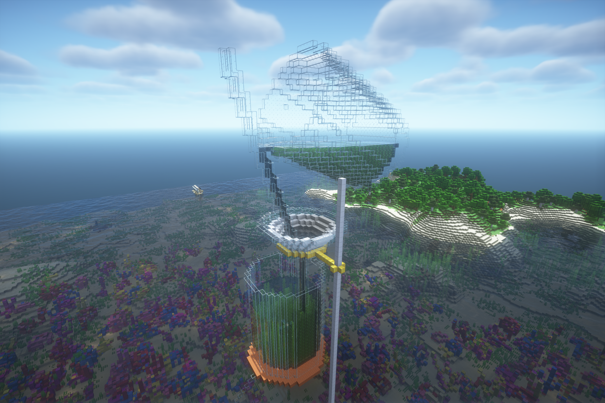

> “引流之主”模型

2019年冬，那个有如“送东阳马生序”中描绘的那么苦寒的冬天，影流之主一度火遍全网，其中，有一系列以初三理化试题插图为核心元素的二创作品，恰好“撞上”了当时的课程内容；在这些之间，又以或许是最初看到的“引流之主”最具代表性，且让我印象最为深刻。

印象中也是计划了若干年，到2024年2月14“情人节”那天，才最终抽出时间修建。

后来，还希望在周围做一些其他的装饰，比如像1.15生存中那样放一个水下玻璃罩的结构，然后在地下埋藏一段影流之主的红石音乐。但因为一直没有时间做具体设计，至今只能维持这种未完成的状态。

-----------

> 字面意义上的“emo”炸了

当时因为某些不变言说的原因，在Minecraft以外也是“emo炸了”的状态，索性就做了一个这样的装置。

不太清楚的点阵像素字符“emo”下面，是几十个同时触发的发射器，投掷出一系列TNT，炸出“emo”的字样：

----------

> 空城标牌与警戒线像素画

前者计划后期作为“空城”项目的主题标牌。因为其命名取自线下生活中的一系列“梗”，要素过多，此处此处擦去了其中的敏感信息。其实2024.3.9就已经完成主体，但也是拖到了3.11这个纪念日才放下最后几个缺失的方块。建造过程估计在十几个小时左右？

后者是Y0猪人塔切门时因为经常“违规操作”而崩服所致的产物。背景部分只用了四个小时（结构简单），后来又用TNT相对快速地依次摆出了“规范施工”四个字。然后贴出来是下面的效果，放在施工现场，即使不能起到劝导“规范施工”的效果，也能据此标记一下当前的施工进度，提醒着规范地多做备份：

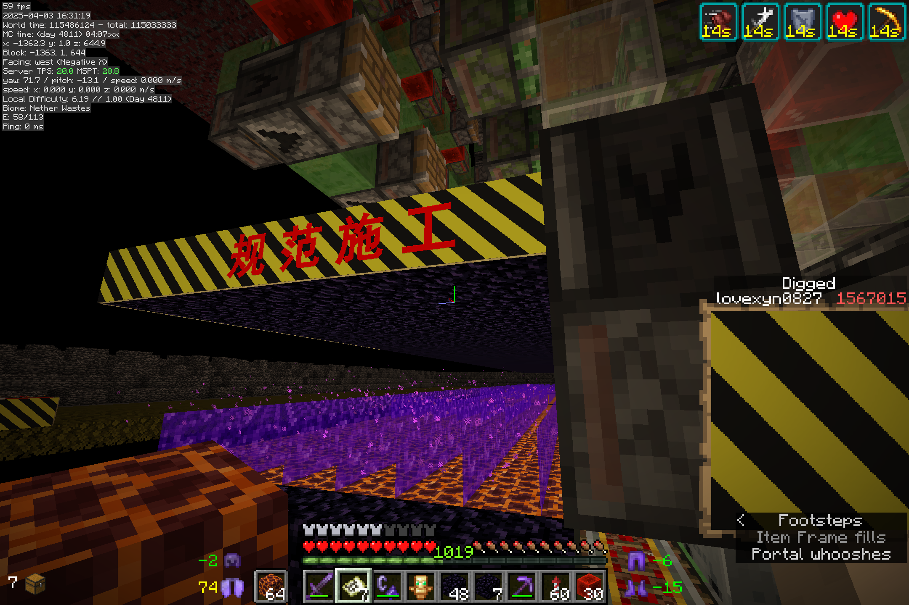

----------

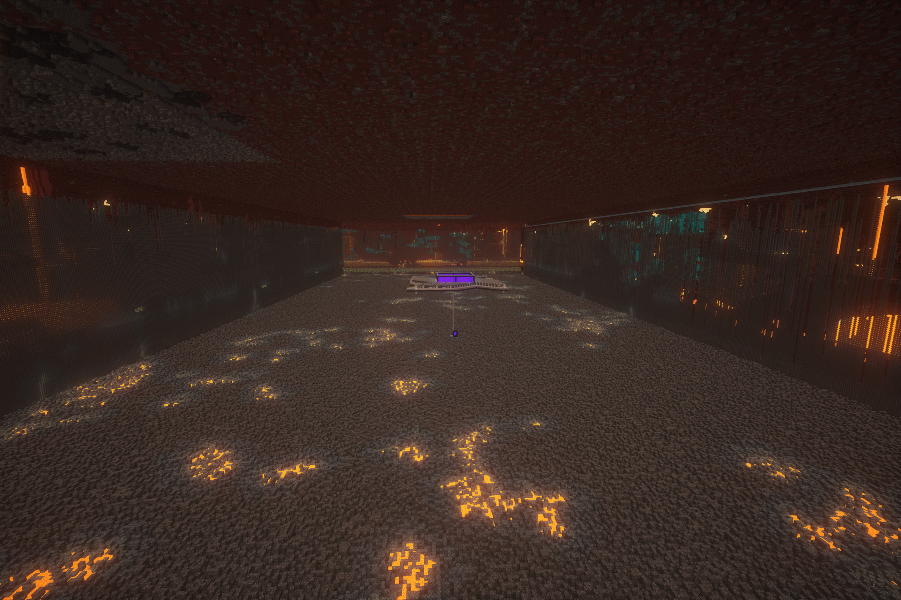

> 下界空置域（靠近下界交通主线的1/2部分，另一部分暂时还没有农场）

一个至少自从2020年10月就把选址等计划了大半，甚至在此前一度差点动工，但最终还是拖到2024年才开始的工程。

为了最大化利用世吞的价值，并尽可能多地覆盖各种生物群系与结构、挖掘远古残骸，空置域覆盖了超过25×100区块。过程相对繁琐，所以放在了另一篇专门的文章当中，其中还给出了一些参考性的经验与技巧。

3000～4000游戏日的大部分都是围绕这个空置域进行的，挖掘耗时240小时+（不过一大箱远古残骸看着属实舒服）下面是全景图

-----------

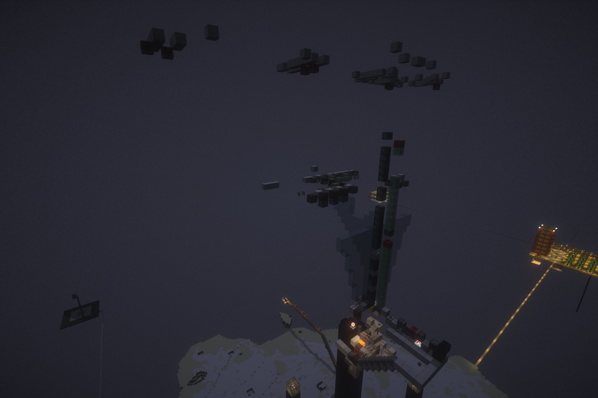

> 天基屠龙炮（废墟）

因为接下来要修采石机，而印象中采石机又需要大量的末地石，索性准备新开一个末地门，修末地石农场。又因末地主岛杂物较多，不便手动打龙，所以就又修了这样一个屠龙炮（什么链式依赖[笑哭]）。然后就是发现现代的采石机不需要末地石[shrug]。

基本上只是将260TNT复制阵列接到了一个简单的箭矢矫正上，设计简单，只做了3小时左右。但是，应是因为没有处理末影人搬运方块，屠龙炮在第一次使用后没有几天没有等太久就自动炸膛。

---------

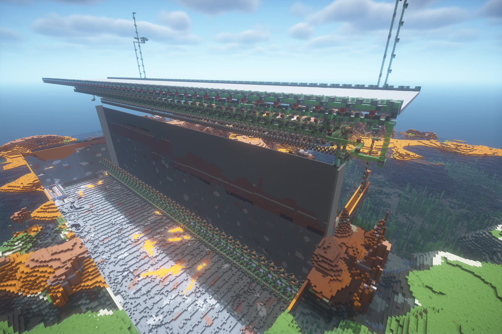

> 采石机

因为后续工程需要大量陶瓦，所以选择在距离原点13000m左右的恶地群系修建。

参照“火弦月”的4分18秒采石机的设计，拓展到存档中的规模。修建耗时50小时左右，然后加上前期准备和遮光顶等附件，预估要接近100小时。整体超过十万方块，是目前包含方块最多的项目

----------

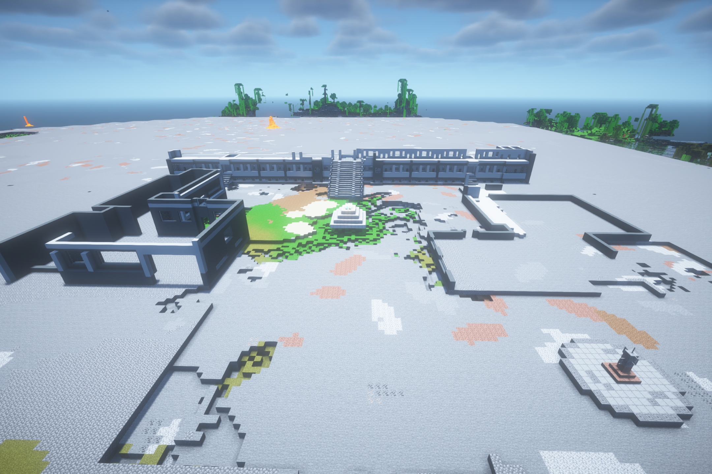

> 鄄城一中东校区（高中校园）复刻现场

当时只做了四个小时，后来因部分细节复刻不够到位，建造蓝图返工调整，至今还未恢复建造。完整建造的话，预计也是一个150+小时的大项目。

而且，虽说是4184天就已经开工，但说到底，当时只是抢在一亿游戏刻到来之前，象征性地放下几个方块，好让这一工程跻身“元老”的行列。

--------

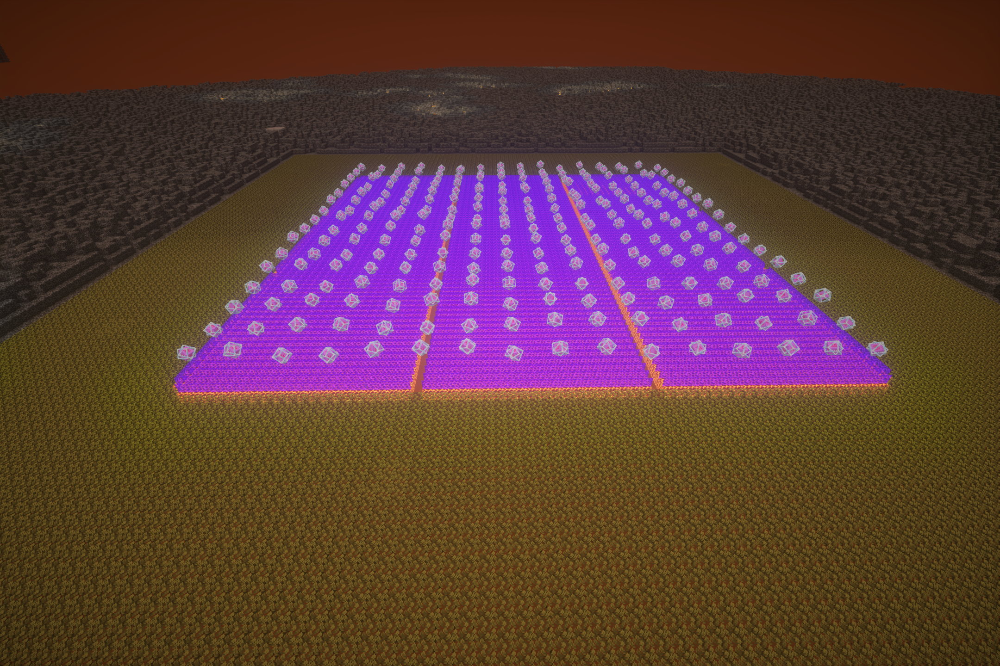

> Y0猪人塔。

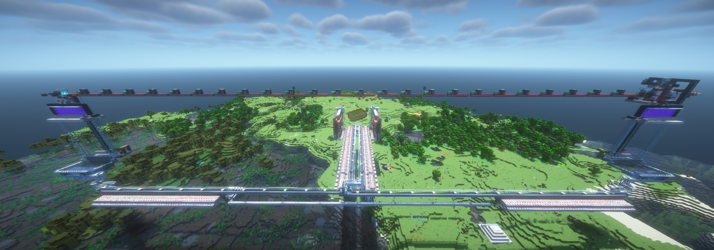

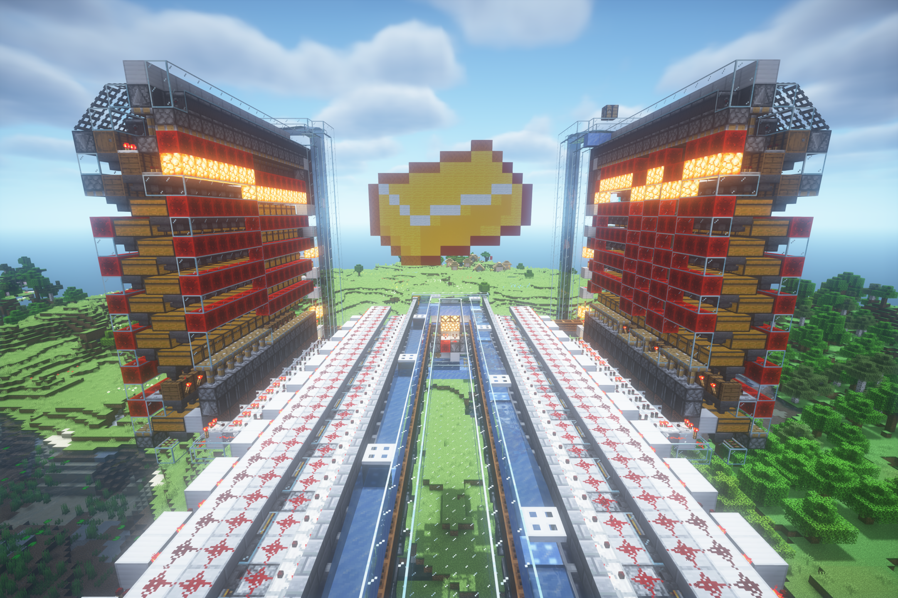

> 以及主世界收集部分

Y0猪人塔的计划可追溯到2020年9月，也就是刚上高中那会。因为那时设想的“黄金岛”和与猪灵的“100万的大交易”需要大量黄金，那段时间曾为此在课余设计了一种Y0猪人塔，还推导了与刷怪游走相关的一条公式算出了它的理论效率。作出效率只有15万的样机不久，网上也陆续有UP主发布了原理相似的猪人塔，我也曾参考它们，重构自己的设计。同时，随着三向破基岩技术的推广，预估破基岩耗时被从1000小时压缩到几十小时，Y0猪人塔又渐渐成为了一个可行的工程。

尽管如此，因为其本身的复杂性，加上，修建过程仍极为繁琐，预估耗时要在120小时+的量级。

首先是破基岩。破开107×107的区域时，每层基岩都需要两小时的时间拆装破基岩机，并随即挂机接近5小时，而10层基岩，就是70小时。枯燥的工作下，DDL被从最初的11月10号，一步步推到了12月31号。

接下来切门。说句实在话，不真正地走上BUD链，真的很难知道切门换底究竟有多么地枯燥、繁琐，而且令人和服务端双双崩溃。64x64的生成平台，切门如果可以一遍过的话，只需要十几个小时。但实际情况是，切门需要严格规范的操作，稍有不注意敲掉一块铁轨，或是挖破上一列已经切好的门，就只能无奈回档。更糟糕的是，因为先前打算切出纵向传送门，提高一点效率，但直到切门进行了一个多月，才发现切纵向门的方案操作太过繁琐，预计耗时甚至接近了其它所有部分的总和，权衡后只能舍去。但此时，先前为切纵向门预留的缝隙又明显降低了生成效率，最后，也只有选择放弃这一个月的进度，从头再来。好在，在崩了不知多少次服，拖迟过多少次DDL，最后又重修了一次BUD链以后，持续了超过一个学期的切门工作最终还是得以完成。

还没结束，在2025年，1.16在生电领域几乎已经成为了远古版本，各种现代化的高级的储存技术都难以适用。加之这里的设计中，下界部分面积为64×64，而不是标准的33×33，现有的处死装置也无法有效处理。此外，巨量的TNT消耗也使得TNT掠夺的无损化成为必须。所以，几乎整个主世界部分都只能从头开始自己设计。经过了许久的尝试，才给出了一个可用的方案。

尽管如此艰难，过程中还是有难得的意外收获。中间因为破基岩机选择的变动，10月19晚上合成的两万活塞暂时失去用途，倒也为后续几年提供了几乎用不尽的活塞储备。

然后，将近380万的效率，和一组TNT挂机一晚上的低成本（尽管是MSPT常常200+）却也“赏心悦目”。

经统计，目前全存档的物资当中，800万的金粒储量竟占据了总量的一半之多。不过至于进一步的合成就是后话了（一想到要用二十多小时合成上百万金锭就……唉）

----

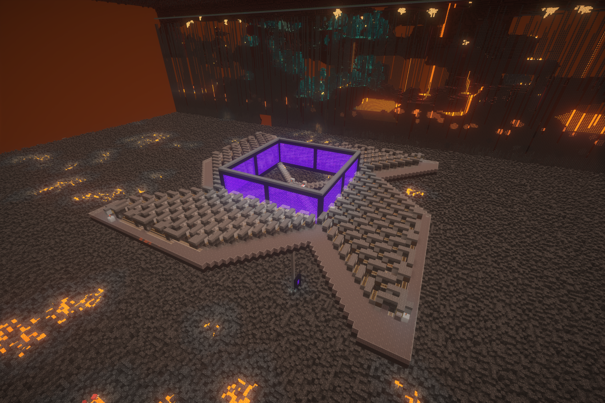

> 新下界堡垒刷怪塔（未完成）

来自“[世外樱花林](https://space.bilibili.com/383985008/?spm_id_from=333.788.upinfo.detail.click)”的设计，现在只做了很小一部分（但也用了好几小时），用来生产烈焰棒，继而为猪人塔供给岩浆块（虽然后面又发现因为更新抑制器的缘故其实不需要自带太多岩浆块）。

## 统计信息

游戏时间：1660小时

死亡次数：91

游戏退出次数：706

鞘翅滑行路程：15633.78km

生物击杀次数：10667690

### 使用最多的工具

- 下界合金镐（1580263）
- 下界合金剑（351484）
- 下界合金锹（173954）
- 铁桶（33363）
- 钻石锹（28006）

### 放置最多的方块

- 铁砧（481223）
- 活塞（145764）
- 圆石（105691）
- 红沙（68546）
- 粘液块（60509）

### 挖掘最多的方块

- 石头（748499）
- 地狱岩（332228）
- 雪片（56456）
- 闪长岩（44397）
- 花岗岩（43160）

### 合成最多的物品

- 骨粉（730678）
- 金锭（454112）
- 绯红木板（237581）
- 铁锭（182938）
- 白桦木版（181657）

### 击杀最多的生物

- 僵尸猪灵（5814008）
- 掠夺者（2022893）
- 卫道士（1645903）
- 幻魔者（433905）
- 女巫（429184）

然后，其实可以注意到，这里好多项目的排名一直都异常稳定，甚至，有些长期霸榜的项目中，也有个别2000天间竟没有一点增加。

## 总结

这2000天，我们实际上只完成了下界空置域，采矿机和Y0猪人塔三个拿得上台面的项目，而这些又无不是自从2020年就开始规划的。不知是屠龙炮这样的小工程已经开始不起眼，还是现在就是大工程占据了主流，总觉，在漫长而繁杂的任务下，与其它许多活动相比，游戏反而成为了一种“繁重”的工作……

不管怎样，至此，我们完成了1000天开荒报告中所列出的最后一项“大工程”，也就是下界空置域，也算是给了当年的期望一个交代。但这并不是结束，JC1Z复刻，“空城”和各种半途停工的农场的后续建设，各种细枝末节的物资量产，137万守卫者农场等等，许多自几年前就提上日程的任务，至今还只是画了个大饼的状态。今生来路漫漫，还望能在Minecraft当中，不紧不慢地，继续行稳致远。