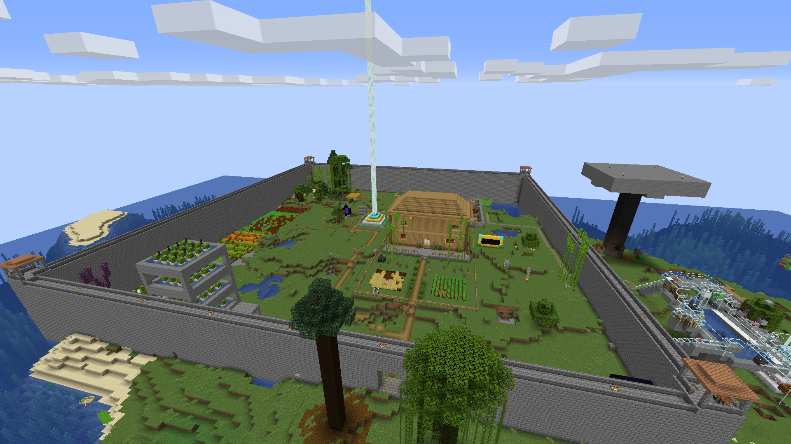
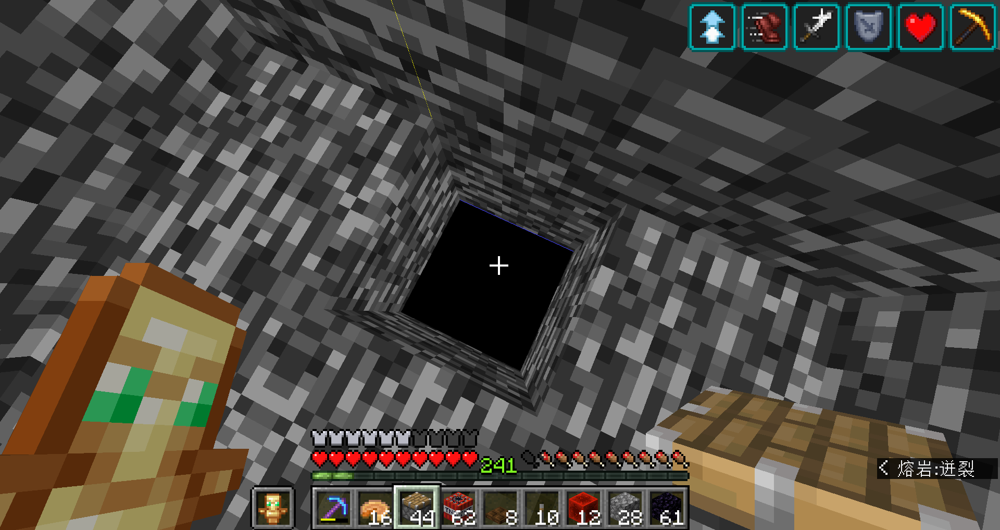

# 迟来的1.15生存最终总结

> 原帖日期：2021-02-07

## 一.总结

存档创建日期：2020/1/12

最后一次建设日期：2020/5/24

总天数：1177

存档大小：2.01G

游戏时间：372.5小时

死亡次数：19

使用最多的工具：钻石镐（163282次）

放置最多的方块：石头（29714次）

破坏最多的方块：石头（99672次）

行走，疾跑，潜行，游泳距离：1637.07KM

鞘翅飞行：1713.71KM

造成/收到伤害：239991/19139

杀死最多的生物：僵尸猪人（28527只）

## 二.部分工程/区域介绍

1. 出生点（建设时间0-约50）

没啥好说的，自己看吧。

2.新家（建设时间约50-490，断断续续）

算是整个档工程量第二大的区域了。圈地，开菜地，建房，人造村庄（似乎被挡住了），装饰，道路，围墙...都在这了。

除围墙有所借鉴，其他建筑均为自制。

**3.矿坑（建设时间234-约290）**

**全档最重要工程，为什么看坑底下就懂了**

4.丛林（建设时间约330-337）

瞎搞的东西，按理说该修大些，但没有。

5.一批农场（建设时间见下）

刷铁机算是自己照着机制瞎搞的，故障率奇高。（建设时间410-430，以后修理很多次）

刷怪塔...只要能造别的，前外别造这种，除非空岛。（建造时间450左右？）

树厂同上（建造时间430-440？）

甘蔗机（建设时间1000前后？）

熔炉组（建造时间550前后，1100前后补上地毯复制模块）

至于右边那个坑，计划修仙人掌通天塔，也成了废案。

6.叫个啥名好？（建设时间约460-490）

自己看吧

7.空置域（主体建设时间765-896，农场见下）

第一个空置域，没经验，炸了十几天（现实）才完事，而且...岩浆遍布。

苦力怕农场：改造的https://www.bilibili.com/video/BV1wE411H72b，效率不高，亏了个空置域，不过也用这个手砍了一万苦力怕。（建造时间：约900-920）

y0史莱姆农场：参考的CarrotLee的方案，破基岩...一千多块，破了一星期，贼费劲。（建造时间约960-1030）

8.”核弹岛“废案（建造时间约1030-1050）

本来想修个核弹岛，发现前面破基岩把TNT用的没几盒了，就开始搁置，最终也没修。

9.刷石机（建造时间1100左右）

自己瞎搞的，效率奇低，只有8000/h，启动了还会长出一个“墓碑”

10.末地工程（主要建造时间约1100-1177）

其中，重载式刷铁机是全档最后一个在建工程，建了个骨架就没再动过。

11.女巫塔废案（建造时间？，估计500-1000之间）

本来想着能缓解红石的短缺，但是也不知道怎么想的，调低视距地面挂机，发现没效率，最后也就放弃了。

**三.另几张截图**

主世界虚空

空置域第一遍轰炸完工

龙蛋？就放这了（猜哪？）

0.5FPS下的光影图

另外，1.16生存一千天开荒纪念Comming Soon